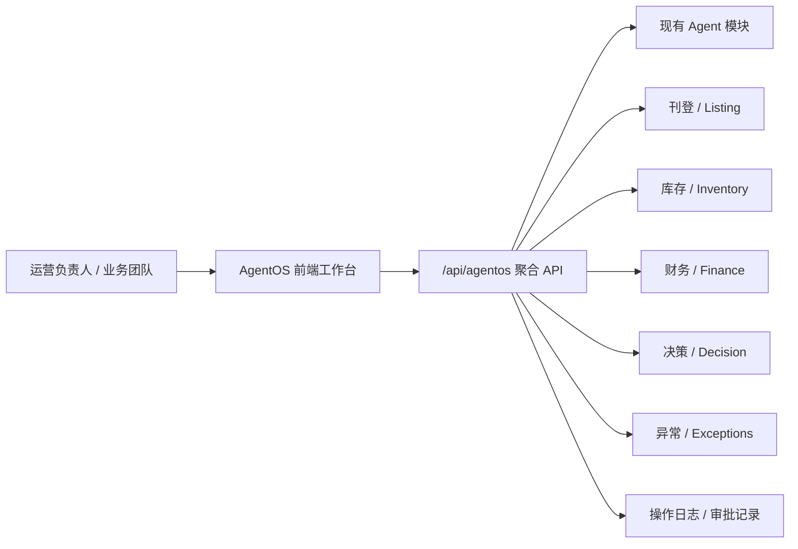
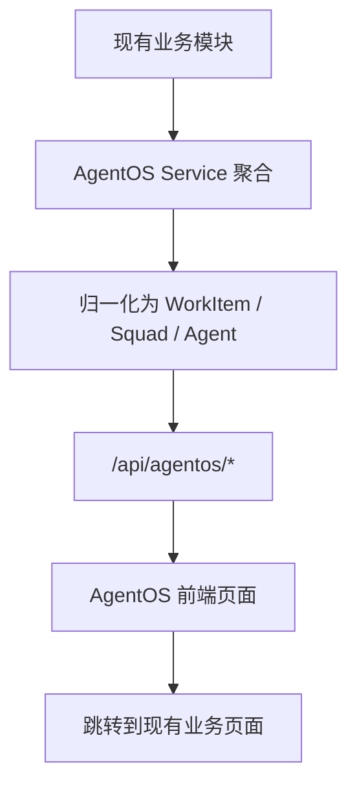
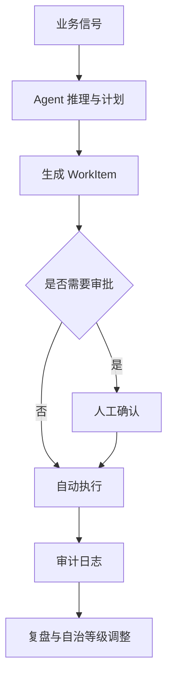

# LingMirror AgentOS 开发文档

更新时间：2026-06-18

本文档用于指导「凌镜 LingMirror / MultiSell」从现有跨境电商系统演进为 AI 原生 AgentOS 团队系统。它面向产品、设计、前端、后端、测试和后续执行开发的 Agent。

## 1. 当前状态

### 1.1 已完成

- 已完成 AI 原生 AgentOS 平台设计文档：
  - `docs/superpowers/specs/2026-06-18-lingmirror-agentos-platform-design.md`
  - 已提交：`9eaeb0f docs: add LingMirror AgentOS platform design`
- 已完成 Phase 1 工程实施计划：
  - `docs/superpowers/plans/2026-06-18-lingmirror-agentos-phase-1.md`
  - 当前为未提交文档，开发前建议先提交或确认纳入本轮开发分支。
- **已实现 AgentOS Phase 1 工程骨架（2026-06-18）**：
  - 后端 `agentos` 聚合模块（schemas / service / router）
  - 四个聚合 API：control-center / work-items / squads / templates
  - WorkItem 归一化层（异常/通知/Agent动作/上架任务）
  - 前端三张页面：总控台、任务中心、Agent 团队页
  - 共享组件：AutonomyBadge、AgentStatusCard、WorkItemCard
  - 一级路由 `/agentos`，默认进入 `/agentos/control-center`
  - 20 个测试用例覆盖归一化逻辑和 API 契约
  - 详情见：[Phase 1 实现计划](../superpowers/plans/2026-06-18-lingmirror-agentos-phase-1.md)
- 已确定产品方向：
  - B 作为第一版工程骨架：总控台优先。
  - C 作为产品组织语言：以 Agent 团队、任务流、自治等级、审批边界组织产品。

### 1.2 尚未完成

- AgentOS 代码实现尚未开始。
- 后端 `agentos` 聚合模块尚未创建。
- 前端 AgentOS 总控台、任务中心、团队页尚未创建。
- Phase 1 的测试、构建和验收尚未执行。

### 1.3 开发结论

现在不是从零做一个通用 Agent Builder，而是在现有 LingMirror 跨境电商业务系统上增加一层 AI 原生工作台：

- 业务系统继续负责商品、库存、刊登、价格、订单、财务等确定性能力。
- AgentOS 负责把这些能力组织为 Agent 团队、任务队列、自治等级、审批流和运营总控台。
- Phase 1 重点是工程骨架和可用产品外壳，不追求真实复杂推理闭环。

## 2. 产品定位

LingMirror AgentOS 是「跨境电商 AI AgentOS」，不是以下几类产品：

- 不是通用聊天机器人。
- 不是通用工作流编排器。
- 不是 Zapier / Dify 式通用 Agent 搭建平台。
- 不是传统 ERP Dashboard 换皮。
- 不是先做桌面自动化的 RPA 工具。

核心定位：

> 让跨境电商团队用一组可观察、可审批、可追责、可逐步自治的 AI Agent 团队经营多平台业务。

用户打开系统后，第一眼看到的不是功能菜单，而是：

- 当前业务风险在哪里。
- 哪些 Agent 正在工作。
- 哪些任务需要人确认。
- 哪些任务可以自动推进。
- 哪些业务线被系统持续监控。

## 3. Phase 1 开发目标

Phase 1 的目标是建立 AgentOS 的第一版工程骨架：

1. 后端提供 AgentOS 聚合 API。
2. 前端提供 AgentOS 一级导航和三张核心页面。
3. 复用现有业务数据，不新增复杂 Agent 执行引擎。
4. 通过 Mock / 聚合 / 归一化方式展示真实产品形态。
5. 为 Phase 2 的真实任务执行、审批闭环和自治升级预留接口。

Phase 1 必须交付：

- `AgentOS 总控台`
- `AgentOS 任务中心`
- `AgentOS Agent 团队页`
- 后端聚合接口
- 前端 API 类型
- 基础测试和构建验证

## 4. 不在 Phase 1 做的事情

为控制范围，以下内容不进入 Phase 1：

- 不开发真实桌面 Agent。
- 不开发浏览器自动操作能力。
- 不开发 IM 群聊机器人。
- 不开发 Agent Marketplace。
- 不开发可视化拖拽 Agent Builder。
- 不重写现有 `backend/app/agent/` 的 Hermes Agent 系统。
- 不重构商品、刊登、库存、财务等业务模块。
- 不引入新的 LLM 调用链路。
- 不引入新的状态机引擎或任务队列中间件。

Phase 1 的正确边界是：做出可信的 AgentOS 产品外壳、数据模型和聚合层，让后续真实执行能力能自然接入。

## 5. 推荐开发方式

### 5.1 分支策略

建议新建开发分支：

```bash
git checkout -b codex/agentos-phase-1
```

如果当前工作区已有大量未提交变更，建议使用独立 worktree：

```bash
git worktree add ../multisell-agentos-phase-1 -b codex/agentos-phase-1
```

注意：

- 不要回滚用户已有改动。
- 不要触碰 `.kilo/worktrees/`。
- 开发前先确认 `docs/superpowers/plans/2026-06-18-lingmirror-agentos-phase-1.md` 是否纳入提交。

### 5.2 推荐执行模式

推荐使用 Subagent-Driven Development：

- 每个任务一个独立 Agent。
- 每个任务完成后由主 Agent review。
- 后端、前端、验证可以清晰分离。

如果单线程执行，也可以按本文第 13 节顺序推进。

## 6. 系统架构

### 6.1 总体架构



Phase 1 的 `agentos` 模块是一个聚合层，不直接替代现有业务模块。

### 6.2 后端模块

新增模块建议：

```text
backend/app/agentos/
  __init__.py
  router.py
  schemas.py
  service.py
```

职责：

- `schemas.py`：定义 AgentOS 对前端暴露的数据契约。
- `service.py`：聚合现有模块数据，并做 WorkItem 归一化。
- `router.py`：暴露 `/api/agentos/*` 接口。
- `__init__.py`：导出 `router`，让 `backend/app/main.py` 自动挂载。

### 6.3 前端模块

新增前端建议：

```text
frontend/src/api/modules/agentos.ts
frontend/src/router/modules/agentos.ts
frontend/src/views/agentos/
  ControlCenter.vue
  WorkItems.vue
  Squads.vue
frontend/src/components/agentos/
  AgentStatusCard.vue
  WorkItemCard.vue
  AutonomyBadge.vue
```

职责：

- `ControlCenter.vue`：总控台首页。
- `WorkItems.vue`：统一任务中心。
- `Squads.vue`：Agent 团队与角色视图。
- `components/agentos/*`：复用卡片、徽标和任务组件。

## 7. 核心产品模型

### 7.1 Agent Squad

Agent Squad 是一组围绕业务目标组织的 Agent 团队，而不是单个机器人。

Phase 1 推荐团队：

| Squad | 业务角色 | 主要职责 |
|---|---|---|
| Growth Squad | 增长团队 | 机会发现、刊登建议、价格建议 |
| Listing Squad | 刊登团队 | 多平台刊登、失败修复、内容检查 |
| Inventory Squad | 库存团队 | 库存风险、补货建议、库存分配 |
| Finance Squad | 财务团队 | 利润、结算、费用异常 |
| Governance Squad | 治理团队 | 权限、审批、自治等级、风险边界 |

### 7.2 Agent

Agent 是可被观察和治理的工作角色。

Phase 1 复用现有 Agent 概念即可，不要求新执行引擎。

Agent 展示字段建议：

- `id`
- `name`
- `squad`
- `role`
- `status`
- `autonomy_level`
- `current_workload`
- `success_rate`
- `last_activity_at`
- `risk_level`

### 7.3 WorkItem

WorkItem 是 AgentOS 的核心统一任务模型。它把来自不同业务模块的事件统一呈现给用户。

建议字段：

```text
id
source_type
source_id
title
description
priority
status
risk_level
agent_id
squad_id
autonomy_level
requires_approval
created_at
updated_at
due_at
action_url
metadata
```

WorkItem 来源包括：

- 刊登失败
- 库存预警
- 利润异常
- 订单异常
- Agent 建议
- 审批待办
- 平台连接异常

### 7.4 Autonomy Level

自治等级沿用现有体系：

| 等级 | 名称 | 行为边界 |
|---|---|---|
| L0 | Observation | 只观察和记录 |
| L1 | Suggestion | 给出建议，需要人执行 |
| L2 | Semi-Autonomous | 可执行低风险动作，高风险需审批 |
| L3 | Full-Autonomous | 在预算、权限、审计边界内自动执行 |

Phase 1 展示自治等级，不做真实升级逻辑。

## 8. 后端接口设计

### 8.1 总控台接口

```http
GET /api/agentos/control-center
```

返回内容：

- 全局健康状态
- 风险摘要
- Agent 团队状态
- 待处理 WorkItem
- 今日自动化结果
- 关键业务指标

建议响应结构：

```json
{
  "overview": {
    "health_score": 86,
    "active_agents": 10,
    "pending_approvals": 6,
    "critical_items": 2
  },
  "squads": [],
  "priority_work_items": [],
  "metrics": [],
  "recent_activity": []
}
```

### 8.2 任务中心接口

```http
GET /api/agentos/work-items
```

查询参数：

- `status`
- `priority`
- `squad`
- `agent_id`
- `requires_approval`
- `limit`
- `offset`

返回内容：

- 分页 WorkItem 列表
- 状态统计
- 筛选统计

### 8.3 Agent 团队接口

```http
GET /api/agentos/squads
```

返回内容：

- Squad 列表
- Squad 下的 Agent 列表
- 当前负载
- 风险状态
- 关键任务数量

### 8.4 模板接口

```http
GET /api/agentos/templates
```

Phase 1 可返回静态模板：

- 新品上架增长模板
- 库存风险处理模板
- 刊登失败修复模板
- 利润异常排查模板

## 9. 后端实现原则

### 9.1 使用现有返回格式

所有 router 必须使用现有统一响应：

- `Result.ok()`
- `Result.error()`
- `Result.bad_request()`
- `Result.not_found()`
- `PageResult.ok()`

不要从 router 直接返回裸 dict。

### 9.2 使用现有数据库会话

使用：

```python
Depends(get_db)
```

不要引入同步数据库调用。

### 9.3 权限

AgentOS 接口建议使用权限：

```text
agentos:view
agentos:operate
agentos:approve
```

Phase 1 至少所有查询接口应挂 `require_permission("agentos:view")`。

### 9.4 聚合优先

Phase 1 不需要新增大量数据库表。优先聚合现有模块：

- `agent`
- `agent_actions`
- `listing_task`
- `inventory`
- `exceptions`
- `finance`
- `decision`
- `operation_log`

如果某类数据暂时无法可靠读取，可以用清晰标注的静态 fallback，但不要把 fallback 伪装成真实执行结果。

### 9.5 归一化函数要可测试

WorkItem 归一化逻辑应优先写成纯函数，便于单元测试：

```python
def normalize_listing_task_to_work_item(task) -> AgentOSWorkItem:
    ...
```

测试重点：

- 优先级映射正确。
- 风险等级映射正确。
- `action_url` 能跳到现有业务页面。
- 缺失字段不会导致接口失败。

## 10. 前端页面设计

### 10.1 一级导航

建议新增一级路由：

```text
/agentos
```

子页面：

```text
/agentos/control-center
/agentos/work-items
/agentos/squads
```

默认进入：

```text
/agentos/control-center
```

### 10.2 总控台布局

总控台是 Phase 1 第一优先级。

推荐首屏结构：

```text
Header: AgentOS 总控台 + 全局状态 + 时间范围

Row 1:
  - 系统健康分
  - 活跃 Agent
  - 待审批
  - 高风险任务

Main:
  Left: 优先处理队列
  Center: Agent 团队运行状态
  Right: 风险与审批边界

Bottom:
  最近活动 / 自动化成果 / 业务指标
```

设计要求：

- 信息密度高。
- 不做营销页。
- 不使用大面积装饰图。
- 不用抽象渐变作为核心视觉。
- 以运营动作和风险判断为中心。

### 10.3 任务中心布局

任务中心用于处理所有 WorkItem。

页面结构：

```text
Top:
  - 状态 Tabs
  - 搜索
  - 筛选器

Content:
  - WorkItem 列表
  - 优先级
  - 来源模块
  - 负责 Agent
  - 是否需要审批
  - 操作按钮
```

Phase 1 操作按钮：

- 查看详情
- 跳转业务页面
- 标记已读或已处理可以先不做真实写入，除非计划中明确实现。

### 10.4 Agent 团队页布局

页面结构：

```text
Left:
  - Squad 列表

Main:
  - Squad 概览
  - Agent 卡片网格
  - 当前任务
  - 自治等级
  - 风险边界
```

Agent 卡片展示：

- 名称
- 角色
- 状态
- 当前负载
- 成功率
- 自治等级
- 最后活动

## 11. 视觉与交互原则

### 11.1 视觉基调

AgentOS 是运营控制台，应采用：

- 克制
- 清晰
- 高密度
- 可扫描
- 风险优先

避免：

- 大标题营销风
- 装饰性渐变背景
- 抽象插画作为核心信息
- 过度卡片嵌套
- 大面积空洞文案

### 11.2 组件原则

优先使用现有技术栈：

- Vue 3
- TypeScript
- Naive UI
- Pinia
- Vite

常用组件：

- `NGrid`
- `NCard`
- `NDataTable`
- `NTabs`
- `NTag`
- `NButton`
- `NProgress`
- `NBadge`
- `NSelect`

### 11.3 空状态和错误状态

每个页面必须处理：

- 加载中
- 接口错误
- 空列表
- 无权限
- 数据部分缺失

不要让页面因为某个聚合来源失败而整体白屏。

## 12. 数据流

### 12.1 Phase 1 数据流



### 12.2 后续数据流

Phase 2 之后可扩展为：



## 13. 推荐开发顺序

### Task 0：开发准备

目标：

- 确认工作区状态。
- 创建开发分支或 worktree。
- 提交或确认保留 Phase 1 plan 文档。

建议命令：

```bash
git status --short
```

### Task 1：后端 Schemas 和归一化函数

目标：

- 创建 `backend/app/agentos/schemas.py`
- 创建基础枚举和 Pydantic 模型
- 创建纯归一化函数
- 编写单元测试

验收：

- Schema 类型清晰。
- WorkItem 映射测试通过。
- 无数据库依赖的测试可快速运行。

### Task 2：后端聚合 API

目标：

- 创建 `backend/app/agentos/router.py`
- 创建 `backend/app/agentos/service.py`
- 暴露四个接口：
  - `/api/agentos/control-center`
  - `/api/agentos/work-items`
  - `/api/agentos/squads`
  - `/api/agentos/templates`

验收：

- FastAPI 自动挂载成功。
- 接口返回统一 Result 格式。
- 权限接入正确。
- 聚合失败时可降级。

### Task 3：前端 API Client 和类型

目标：

- 新增 `frontend/src/api/modules/agentos.ts`
- 定义 TS 类型
- 导出命名 API 方法

验收：

- API 类型与后端响应一致。
- TypeScript 编译通过。

### Task 4：前端路由和共享组件

目标：

- 新增 `frontend/src/router/modules/agentos.ts`
- 新增共享组件：
  - `AgentStatusCard.vue`
  - `WorkItemCard.vue`
  - `AutonomyBadge.vue`

验收：

- 左侧导航或主导航可进入 AgentOS。
- 组件没有业务页面强耦合。

### Task 5：总控台页面

目标：

- 新增 `ControlCenter.vue`
- 接入 `/api/agentos/control-center`
- 展示概览、优先任务、团队状态、风险摘要。

验收：

- 首屏可用。
- 空状态和错误状态可用。
- 核心操作能跳转现有业务页面。

### Task 6：任务中心页面

目标：

- 新增 `WorkItems.vue`
- 支持筛选和列表展示。

验收：

- 可按状态、优先级、团队、审批需求筛选。
- 任务卡片信息完整。

### Task 7：Agent 团队页

目标：

- 新增 `Squads.vue`
- 展示 Squad 和 Agent 状态。

验收：

- 能清楚看出每个团队的业务职责。
- 能查看 Agent 状态和自治等级。

### Task 8：完整验证

目标：

- 后端测试。
- 前端构建。
- 浏览器手动检查。

建议命令：

```bash
cd backend && PYTHONPATH="$PWD" .venv/bin/python -m pytest -q
cd frontend && npm run build
```

## 14. 验收标准

### 14.1 产品验收

Phase 1 完成后，用户应能回答：

- 当前 AgentOS 整体健康吗？
- 哪些 Agent 正在工作？
- 哪些任务最紧急？
- 哪些任务需要审批？
- 哪些业务模块正在产生风险？
- 下一步应该点击哪里处理？

### 14.2 工程验收

必须满足：

- 后端新增模块符合项目模块规范。
- 前端新增页面符合现有 Vue / Naive UI 风格。
- 路由可访问。
- 接口返回稳定。
- 测试覆盖归一化和接口基础行为。
- `npm run build` 通过。
- 不破坏现有业务页面。

### 14.3 文档验收

开发完成后应更新：

- `docs/INDEX.md`
- `docs/TIMELINE.md`
- 本文档的状态部分
- 如有新增接口，补充接口说明

## 15. 风险与处理

### 15.1 聚合数据来源不稳定

风险：

- 某些业务模块字段不一致。
- 某些表在本地开发库无数据。

处理：

- 聚合层容错。
- 空数据返回空列表，不抛 500。
- 测试中覆盖缺失字段。

### 15.2 页面看起来像普通 Dashboard

风险：

- 如果只堆 KPI，产品会失去 AI 原生感。

处理：

- 页面核心围绕 Agent、WorkItem、Autonomy、Approval。
- KPI 只是辅助，不是主角。

### 15.3 过早做复杂 Agent 执行

风险：

- Phase 1 范围失控。

处理：

- 只做聚合和展示。
- 所有真实执行能力进入 Phase 2。

### 15.4 权限和审批边界不清

风险：

- 用户不知道 Agent 能做什么、不能做什么。

处理：

- 每个 Agent 显示自治等级。
- 高风险任务显示审批要求。
- 操作必须能追溯到业务页面或审计日志。

## 16. 后续 Phase 2 方向

Phase 2 可做：

- WorkItem 状态写入。
- 审批动作。
- Agent 行动执行记录。
- 自治等级升级规则。
- 真实 LLM 推理接入。
- 平台异常自动修复建议。
- IM 通知和审批提醒。
- 桌面 Agent / 浏览器 Agent 的受控接入。

Phase 2 的前提是 Phase 1 的数据模型和页面结构稳定。

## 17. 开发交接格式

每个开发任务完成后，执行者应汇报：

```text
完成内容：
- ...

修改文件：
- ...

验证：
- ...

风险：
- ...

下一步：
- ...
```

如果使用子 Agent，每个子 Agent 必须只负责一个明确任务，并在完成后交回：

- 修改摘要
- 测试结果
- 未解决问题
- 是否触碰计划外文件

## 18. 推荐第一步

如果现在开始开发，第一步建议是：

1. 提交当前 Phase 1 plan 文档。
2. 创建 `codex/agentos-phase-1` 分支或 worktree。
3. 执行 Task 1：后端 AgentOS Schema 和 WorkItem 归一化函数。

原因：

- Schema 会固定前后端契约。
- 归一化函数是 AgentOS 的核心数据模型。
- 先做纯函数测试，风险最低。
- 后续页面和聚合接口都依赖这一步。

