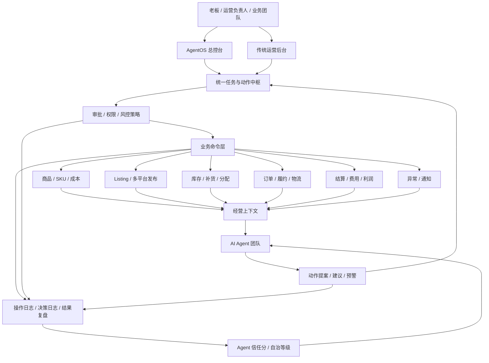
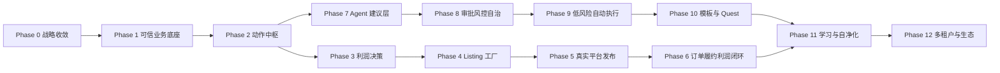

# LingMirror Agent Commerce OS 完整蓝图与开发路径

> [!CAUTION]
> **已冻结的长期历史蓝图。** 本文的 Owner 自用商品实验、外部客户、SaaS、多租户、开放平台、生态和规模化路线均不是当前授权。当前入口见 `OCEAN_GOAL.md`、`PRODUCT.md`、`CURRENT.md` 和 `BACKLOG.md`。

产品品牌：凌镜 LingMirror
技术项目名：MultiSell
日期：2026-06-22
定位：完整产品蓝图、架构原则、分阶段开发路径和验收标准

---

## 1. 总结

凌镜 LingMirror 不应该被定义为传统跨境 ERP，也不应该被定义为单点 AI 工具。

完整目标是：

```text
凌镜 LingMirror 是 AI 原生跨境商品经营操作系统。
它让 10 人以内的小团队通过 Agent 管理海量 SKU、多平台上架、利润决策、库存价格监控、订单履约、异常处理和经营复盘。
```

核心产品判断：

```text
旧模式负责可信经营底座，新模式负责经营杠杆。
产品不拆，架构分层；客户看到两个入口，系统内部只有一套可信业务底座。
```

最终不是让人管理更多页面，而是让人管理一组可观察、可审批、可追责、可逐步自治的 AI 经营 Agent。

---

## 2. 商业逻辑

凌镜的商业逻辑不是“帮卖家省几个运营”，而是“让跨境商品经营动作被系统化、自动化、规模化”。

客户真正付费的结果：

- 更少的人管理更多 SKU。
- 更快判断商品能不能卖。
- 更少亏损 SKU、错误上架、库存事故和费用漏算。
- 多平台经营不再依赖个人经验和表格。
- 经营动作有审计、有复盘、有持续优化能力。

核心经营指标：

| 指标 | 早期目标 | 成熟目标 |
|---|---:|---:|
| SKU / 人 | 提升 5-10 倍 | 提升 20-100 倍 |
| 上架决策时间 | 降低 80% | 接近实时 |
| 自动化经营动作占比 | 50% | 80%-95% |
| 人工介入率 | 每 100 个事件介入 20-30 个 | 每 1000 个事件介入 20-50 个 |
| 亏损 SKU 发现速度 | 日级 | 分钟级 |
| 操作可追溯率 | 100% | 100% |

长期商业模式可以组合：

- SaaS 订阅：按店铺、平台、SKU、用户数收费。
- 自动化动作费：按成功生成 Listing、发布任务、利润复盘、异常处理等动作收费。
- GMV 抽成：对高信任客户按 GMV 或利润提升收费。
- 企业版：私有部署、平台定制、风控策略、审计和权限。
- Agent 模板和技能市场：对成熟经营工作流收费。

---

## 3. 产品原则

### 3.1 一套底座，两个入口

系统只有一套业务底座：

- 商品。
- SKU。
- 供应商。
- 成本。
- 物流。
- 平台费用。
- Listing。
- 库存。
- 订单。
- 结算。
- 利润。
- 异常。
- 权限。
- 审计。

但产品对外有两个入口：

| 入口 | 目标用户 | 产品形态 |
|---|---|---|
| 运营后台 | 传统运营、财务、仓库、管理员 | 手动操作、数据维护、报表、审核 |
| AgentOS 总控台 | 老板、运营负责人、AI 运营团队 | 建议、任务、审批、风险、Agent 状态、自动化结果 |

旧模式不是废弃对象，而是 AgentOS 的可信底座。新模式不能绕过旧模式，Agent 必须通过业务动作和审批策略调用底座能力。

### 3.2 Agent 不直接改数据库

Agent 只能创建动作提案或调用受控业务命令：

```text
Agent Observation
  -> Action Proposal
  -> Policy Check
  -> Approval / Auto Approval
  -> Business Command
  -> Audit Log
  -> Business Result
  -> Outcome Review
```

禁止 Agent 直接写核心业务表。所有高风险动作必须进入审批或被策略拦截。

### 3.3 所有经营动作都要标准化

人和 Agent 都通过同一套动作中枢操作系统。

标准动作包括：

- 创建商品。
- 创建 SKU。
- 更新成本。
- 计算物流费。
- 计算平台费。
- 测算利润。
- 判断是否上架。
- 生成 Listing。
- 创建发布任务。
- 同步发布状态。
- 调整售价。
- 分配库存。
- 创建补货建议。
- 标记异常。
- 处理异常。
- 生成日报。
- 生成利润复盘。

同一个动作可以由人手动触发，也可以由 Agent 发起。

### 3.4 风险分级决定自动化边界

| 风险级别 | 行为 |
|---|---|
| 低风险 | Agent 可自动执行，写审计 |
| 中风险 | Agent 发起，人审批后执行 |
| 高风险 | Agent 只能建议，不能执行 |
| 禁止项 | 系统直接拦截 |

默认高风险动作：

- 真实发布到平台。
- 大批量调价。
- 大批量下架。
- 广告预算调整。
- 采购和补货下单。
- 退款、赔付和财务动作。
- 平台授权、密钥、银行、税务信息变更。

### 3.5 AI 决策必须绑定经营结果

Agent 的价值不能只看“生成内容好不好”，必须看经营结果：

- 建议是否被采纳。
- 采纳后是否赚钱。
- 是否减少亏损。
- 是否减少人工操作。
- 是否减少异常处理时间。
- 是否降低错误率。

---

## 4. 完整系统架构



### 4.1 业务数据底座

负责沉淀可信经营事实。

范围：

- 商品、SKU、分类、品牌、供应商。
- 成本、采购价、包装尺寸、重量、物流属性。
- 平台、平台账号、平台费用规则、平台字段映射。
- Listing、发布任务、发布状态、发布失败原因。
- 库存、锁定库存、在途库存、库存日志。
- 订单、订单明细、状态日志、履约信息。
- 物流渠道、报价规则、运费快照、运费账单。
- 平台结算、支付费、其他费用、利润账本。
- 异常、通知、操作日志、审批记录。

这一层必须稳定、可测试、可迁移、可审计。

### 4.2 业务命令层

负责把业务变化封装成明确命令。它是手动后台和 AgentOS 共用的执行入口。

示例命令：

```text
ProductCommand.create_sku
ProfitCommand.calculate_prelisting_profit
ListingCommand.generate_draft
ListingCommand.create_publish_task
PricingCommand.propose_price_change
InventoryCommand.allocate_stock
ExceptionCommand.resolve_exception
FinanceCommand.reconcile_settlement
```

每个命令必须定义：

- 输入参数。
- 权限要求。
- 风险等级。
- 可否自动执行。
- 输出结果。
- 审计字段。
- 失败原因。

### 4.3 统一任务与动作中枢

这是旧模式和新模式结合的关键。

统一模型建议：

```text
ActionProposal
WorkItem
ApprovalRequest
BusinessCommandExecution
OutcomeReview
```

`ActionProposal` 表示 Agent 或系统提出的动作。
`WorkItem` 表示人需要看到或处理的统一任务。
`ApprovalRequest` 表示需要人批准的动作。
`BusinessCommandExecution` 表示真实执行记录。
`OutcomeReview` 表示执行后的经营结果复盘。

状态流：

```text
suggested
-> pending_approval
-> approved
-> executing
-> executed
-> reviewed
```

旁路状态：

```text
rejected
expired
blocked_by_policy
failed
cancelled
```

### 4.4 Agent 决策层

Agent 不是聊天机器人，而是经营职责角色。

完整 Agent 矩阵：

| Squad | Agent | 职责 |
|---|---|---|
| Growth Squad | 选品 Agent | 发现候选商品、评估机会、识别风险 |
| Growth Squad | Listing Agent | 生成标题、卖点、描述、多语言内容、平台字段 |
| Growth Squad | 流量 Agent | 广告建议、关键词建议、Listing 优化建议 |
| Fulfillment Squad | 库存 Agent | 库存预警、补货建议、分配建议 |
| Fulfillment Squad | 履约 Agent | 订单状态、物流方案、超时和失败处理 |
| Fulfillment Squad | 供应链 Agent | 供应商、采购提前期、成本变化监控 |
| Finance Squad | 利润 Agent | 上架前利润、订单利润、亏损归因 |
| Finance Squad | 结算 Agent | 平台账单、物流账单、差异核对 |
| Risk Squad | 合规 Agent | 平台规则、禁售、敏感词、类目风险 |
| Risk Squad | 折扣风控 Agent | 折扣、促销、价格保护和亏损拦截 |
| Governance Squad | 主管 Agent | 任务分派、自治等级、审批边界、Agent 绩效 |

### 4.5 审批与风控层

风控层必须在业务命令执行前运行。

策略维度：

- 用户权限。
- Agent 自治等级。
- 动作风险等级。
- 金额阈值。
- SKU 数量阈值。
- 平台范围。
- 是否首次动作。
- 是否可逆。
- 是否影响财务。
- 是否影响真实平台。
- 是否命中红线规则。

### 4.6 AgentOS 总控台

总控台不是指标看板，而是经营任务入口。

核心视图：

- 今日经营健康度。
- Agent 正在做什么。
- 哪些动作需要审批。
- 哪些 SKU 有利润、库存、价格或履约风险。
- 哪些 Listing 失败或需要修复。
- 哪些异常正在阻塞经营。
- 哪些自动化动作已经执行。
- 哪些 Agent 应该升级或降级自治等级。

### 4.7 外部连接层

完整系统需要连接：

- Ozon、Shopee、Wildberries、Amazon、TikTok Shop 等平台。
- ERP 或表格导入。
- 物流商、仓储、面单和轨迹系统。
- 支付、账单、平台结算。
- AI 模型、向量库、规则引擎。
- IM、邮件、通知系统。

外部连接必须被包装为受控工具。Agent 只能调用经过授权的工具，不能直接持有平台密钥。

---

## 5. 当前项目映射

现有 MultiSell 已经具备相当多的底座能力。

| 完整蓝图层 | 当前模块 |
|---|---|
| 商品数据 | `core`、`category`、`brand`、`sku`、`supplier` |
| 成本价格 | `price`、`platform_fee`、`shipping`、`finance` |
| 库存订单 | `inventory`、`order`、`order_import` |
| 发布平台 | `platform`、`listing`、`listing_task` |
| 决策链路 | `decision`、`allocation` |
| 财务结算 | `settlement`、`finance` |
| 异常通知 | `exceptions`、`notification` |
| 权限审计 | `auth`、`rbac`、`operation_log` |
| Agent | `agent`、`agent_actions` |
| AgentOS | `agentos` |
| AI 生成 | `image_gen` |

缺口不是“完全没有系统”，而是：

- 动作中枢还没有成为统一抽象。
- Agent 建议、审批、执行、复盘还没有形成完整闭环。
- 真实平台 adapter 还没有成为生产级能力。
- Agent 绩效和经营结果还没有强绑定。
- 旧后台和 AgentOS 还没有统一到同一套经营动作语言。

---

## 6. 完整开发路径

开发路径按 12 个阶段推进。每个阶段都必须能独立验收，但全部阶段共同指向完整 Agent Commerce OS。

### Phase 0：战略收敛与产品边界

目标：

```text
统一项目叙事：凌镜不是 ERP + AI 功能，而是 AI 原生跨境商品经营 OS。
```

交付：

- 完整蓝图文档。
- 产品边界定义。
- 旧模式和新模式结合原则。
- 关键商业指标。
- 阶段路线图。

验收：

- 团队能用同一句话解释产品。
- 后续需求能判断属于底座、动作中枢、Agent、风控、总控台还是外部连接。
- 不再用“加一个页面”作为主要开发语言。

状态：

- 本文档即 Phase 0 的主交付物。

### Phase 1：可信业务底座强化

目标：

```text
让商品、SKU、成本、物流、平台费、库存、订单、结算、利润和异常数据可信、可追溯、可测试。
```

重点模块：

- 商品/SKU/供应商/品牌/分类。
- 物流报价和运费计算。
- 平台费用规则。
- 库存锁定和扣减。
- 订单导入。
- 平台结算和物流账单导入。
- 利润账本。
- 异常工作台。
- RBAC 和操作日志。

关键任务：

- 补齐分类、品牌等基础接口的权限和审计。
- 明确费用、利润、库存、订单的统一口径。
- 保证订单、库存、利润链路有稳定测试。
- 建立演示数据和验收脚本。
- 修复生产启动、迁移和配置风险。

验收：

- 后端测试全量通过。
- 前端生产构建通过。
- 从空库迁移后可启动。
- Demo 数据可重放。
- 任意关键经营数据能追溯来源。

### Phase 2：业务命令层与动作中枢

目标：

```text
把人和 Agent 的操作统一成可审计、可审批、可复盘的经营动作。
```

新增核心模型：

- `ActionProposal`：动作提案。
- `WorkItem`：统一任务。
- `ApprovalRequest`：审批请求。
- `CommandExecution`：执行记录。
- `OutcomeReview`：结果复盘。

关键任务：

- 定义动作类型枚举。
- 定义风险等级和状态机。
- 把 Listing 任务、异常、通知、Agent Action 归一化到 WorkItem。
- 给核心业务命令增加统一审计字段。
- 建立审批 API。
- 前端任务中心支持筛选、审批、拒绝、查看审计。

验收：

- 人工操作和 Agent 建议能进入同一任务中心。
- 每个动作能看到来源、建议、风险、审批状态、执行结果。
- 高风险动作不会绕过审批。
- 任务状态流转有后端测试覆盖。

### Phase 3：利润决策与 SKU 经营引擎

目标：

```text
系统能标准化判断一个 SKU 在某个平台、国家、物流方案和售价下是否值得经营。
```

关键任务：

- 统一 SKU 成本结构。
- 统一物流费计算输入和输出。
- 统一平台费、支付费、其他费用计算。
- 建立上架前利润测算快照。
- 建立利润阈值和风险原因模型。
- 支持批量 SKU 决策。
- Agent 可以生成利润建议，但不能直接发布。

验收：

- 任意 SKU 可生成上架前利润报告。
- 批量 SKU 能返回可上架、需补资料、不建议上架三类结果。
- 每个“不建议上架”都有结构化原因。
- 利润计算结果可被订单利润复盘验证。

### Phase 4：Listing 工厂与内容生成

目标：

```text
从 SKU 决策结果生成多平台 Listing 草稿，并进入发布任务。
```

关键任务：

- 平台字段映射模型。
- 平台类目映射。
- 标题、卖点、描述、多语言内容生成。
- 图片需求和图片生成任务。
- Listing 草稿版本管理。
- AI 生成结果 schema 校验。
- 人工确认和修改流程。

验收：

- 通过利润测算的 SKU 可一键生成 Listing 草稿。
- 草稿字段符合目标平台基础要求。
- AI 生成内容必须通过结构化校验。
- 人工修改有版本和审计记录。

### Phase 5：真实平台发布与同步

目标：

```text
打通至少一个真实平台 adapter，让决策到发布形成真实闭环。
```

建议顺序：

1. Ozon 或 Shopee。
2. Wildberries。
3. TikTok Shop。
4. Amazon。

关键任务：

- 平台授权和密钥加密。
- 真实发布请求。
- 发布错误解析。
- 发布状态同步。
- 失败重试。
- 平台字段校验。
- 发布前审批。

验收：

- 从 SKU 决策到 Listing 草稿到发布任务到真实平台状态同步可跑通。
- 平台失败原因可读、可重试、可审计。
- 平台密钥不返回前端、不进入日志。

### Phase 6：订单、履约、库存、利润闭环

目标：

```text
发布后的真实经营结果能回流系统，形成经营复盘。
```

关键任务：

- 订单导入和平台订单同步。
- 库存锁定、扣减、释放和退货入库。
- 物流方案选择和运费快照。
- 平台结算导入。
- 物流账单导入。
- 订单级利润复盘。
- 亏损归因。
- 履约异常。

验收：

- 任意订单能看到预计利润和实际利润差异。
- 亏损订单能归因到售价、平台费、物流费、采购成本、退款或异常。
- 库存变化能追溯到订单和操作。

### Phase 7：Agent 建议层

目标：

```text
Agent 先成为可靠的经营建议者，而不是立刻自动执行者。
```

首批 Agent：

- 利润 Agent。
- Listing Agent。
- 库存 Agent。
- 异常 Agent。
- 结算 Agent。
- 主管 Agent。

关键任务：

- Agent 读取经营上下文。
- Agent 输出结构化建议。
- 建议进入 ActionProposal。
- 建议可采纳、修改、拒绝。
- 用户反馈写入决策日志。
- 建议与经营结果绑定。

验收：

- Agent 建议不是纯文本，必须带业务对象、建议动作、风险、理由和预期收益。
- 用户对建议的操作会影响 Agent 信任分。
- 总控台能展示今日建议、待审批、已执行和被拒绝建议。

### Phase 8：审批、风控与自治等级

目标：

```text
建立从建议到半自动执行的安全边界。
```

关键任务：

- 动作风险策略。
- Agent 自治等级。
- 红线规则。
- 金额和批量阈值。
- 自动审批策略。
- 紧急暂停。
- Agent 升级/降级机制。

验收：

- 低风险动作可自动执行。
- 中风险动作必须审批。
- 高风险动作只能建议。
- 红线动作直接拦截。
- 用户可以暂停单个 Agent 或全部 Agent。

### Phase 9：低风险自动执行

目标：

```text
让 Agent 接管低风险、高频、重复的经营动作。
```

优先自动化动作：

- 生成 Listing 草稿。
- 生成日报。
- 标记异常。
- 发通知。
- 生成利润复盘。
- 更新内部建议价。
- 创建待审批发布任务。
- 创建待审批补货建议。

不自动化动作：

- 真实大批量发布。
- 大幅调价。
- 采购下单。
- 退款赔付。
- 平台密钥变更。

验收：

- 自动动作都有执行记录和结果复盘。
- 自动动作失败会进入任务中心。
- 自动化动作占比可统计。
- 人工介入率可统计。

### Phase 10：模板、技能与 Quest 工作流

目标：

```text
把高频经营流程产品化为可复用模板和技能。
```

首批模板：

- 新品上架评估。
- 多平台 Listing 生成。
- 库存风险巡检。
- 利润亏损巡检。
- 结算差异检查。
- 发布失败修复。
- 每日经营日报。

Quest 模式：

```text
用户设定目标 -> 系统拆解任务 -> Agent 执行低风险步骤 -> 风险处中断请求审批 -> 输出结果复盘
```

验收：

- 用户可以从模板发起 Quest。
- Quest 过程可中断、可审批、可恢复。
- Quest 输出有经营结果和审计链路。

### Phase 11：Agent 学习、自净化与信任系统

目标：

```text
让 Agent 根据反馈和经营结果持续优化，但不能失控。
```

关键任务：

- Agent 信任分。
- 建议采纳率。
- 执行成功率。
- 经营结果评分。
- 规则健康评分。
- TTL 和过期规则。
- 冲突检测。
- Regret 和失败复盘。
- SPC 稳定性监控。

验收：

- Agent 自治等级由表现驱动，而不是手动拍脑袋。
- 低质量规则会被标记、降权或要求人工确认。
- Agent 表现下降会自动降级或暂停。

### Phase 12：多租户、开放平台与生态

目标：

```text
从单客户系统演进为可规模化商业平台。
```

关键任务：

- 多租户隔离。
- 组织、店铺、平台账号隔离。
- API token 和外部集成。
- 计费和用量统计。
- Agent 模板市场。
- 平台连接市场。
- 企业审计和数据导出。
- 权限、合规、备份、恢复。

验收：

- 不同客户数据完全隔离。
- 可按 SKU、店铺、动作、用户、GMV 统计用量。
- 可支持企业版权限、审计、备份和恢复。

---

## 7. 阶段依赖关系



依赖原则：

- 没有可信数据，不做高自治 Agent。
- 没有动作中枢，不做自动执行。
- 没有真实平台闭环，不夸大商业验证。
- 没有结果复盘，不做自学习。
- 没有多租户隔离，不做平台化销售。

---

## 8. 组织与 10 人以内团队分工

完整系统可以由 10 人以内团队推进，但必须严格分工。

建议配置：

| 角色 | 人数 | 职责 |
|---|---:|---|
| 产品/CEO | 1 | 客户验证、商业指标、产品边界 |
| 技术负责人 | 1 | 架构、代码质量、阶段验收 |
| 后端工程师 | 2 | 业务底座、动作中枢、平台连接、权限审计 |
| 前端工程师 | 1-2 | 运营后台、AgentOS、任务中心、审批体验 |
| AI/Agent 工程师 | 1-2 | Agent 建议、工具调用、信任分、模板 Quest |
| 测试/交付/实施 | 1 | 测试、演示数据、客户接入、反馈闭环 |
| 业务运营专家 | 1 | 跨境规则、平台字段、费用口径、客户场景 |

团队原则：

- 不设独立“大数据团队”。
- 不先做通用 Agent 平台团队。
- 不让 AI 工程脱离业务闭环。
- 每个阶段都必须有可演示的经营结果。

---

## 9. 近期执行顺序

虽然目标是完整系统，近期仍然要按最短价值路径推进。

推荐顺序：

1. 明确完整蓝图和开发路径。
2. 整理当前 ROADMAP，把阶段名称对齐到 Agent Commerce OS。
3. 做动作中枢设计文档。
4. 实现统一 WorkItem / ActionProposal / ApprovalRequest。
5. 把现有异常、通知、Listing 任务、Agent Action 统一进任务中心。
6. 强化 SKU 利润决策和批量决策。
7. 做 Listing 工厂。
8. 接入第一个真实平台 adapter。
9. 做 Agent 建议到审批闭环。
10. 开始低风险自动执行。

历史提案曾要求另建 Phase 2 动作中枢计划；该占位计划从未创建，且当前方向已冻结这项扩张。

---

## 10. 不做什么

为了保持方向，以下内容暂不进入主线：

- 不做通用 Agent Builder。
- 不做开放式拖拽工作流。
- 不做没有跨境业务语义的聊天机器人。
- 不让 Agent 直接操作数据库。
- 不先做全平台同时接入。
- 不先做复杂自学习和跨用户推荐。
- 不绕过权限、审批、审计。
- 不把旧后台废掉重做。
- 不把 AgentOS 和 ERP 拆成两个数据系统。

---

## 11. 成功标准

### 11.1 产品成功标准

- 用户每天从 AgentOS 总控台开始工作。
- 任务中心覆盖主要经营风险。
- 低风险动作可以自动执行。
- 中高风险动作可以审批。
- 关键经营动作全部可审计。

### 11.2 商业成功标准

- 客户愿意为自动化经营结果付费，而不是只为页面付费。
- 单个运营可管理 SKU 数显著提升。
- 亏损 SKU 和错误上架下降。
- 发布效率提升。
- 客户愿意接入真实平台账号和订单数据。

### 11.3 技术成功标准

- 后端测试稳定。
- 前端构建稳定。
- 数据迁移可靠。
- Agent 行为可追踪。
- 平台密钥安全。
- 多租户前的数据边界清晰。

---

## 12. 最终形态

完整 LingMirror 的最终状态：

```text
人类设定经营目标、审批关键风险、查看结果复盘。
Agent 发现机会、生成建议、发起动作、执行低风险任务、监控异常、复盘结果。
系统负责可信数据、统一动作、权限审批、风控审计、平台连接和经营指标。
```

一句话：

```text
凌镜 LingMirror 要把跨境电商从“人操作系统”变成“人监管 Agent 经营网络”。
```
