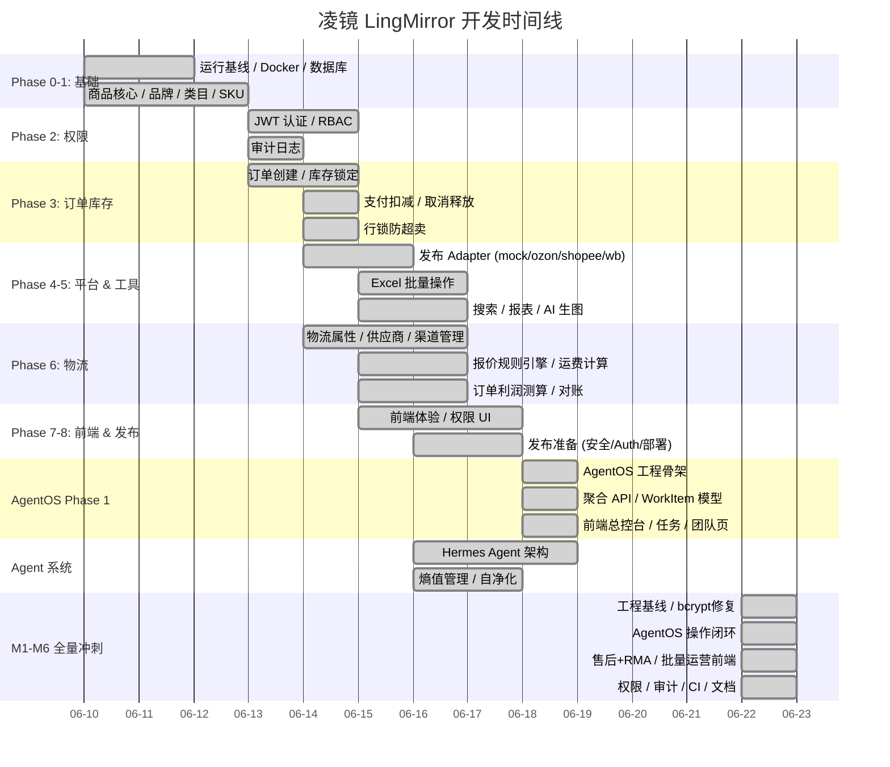

# 凌镜 LingMirror — 开发时间线

> 从原型到可用平台的演进历程。
> 最后更新：2026-06-22

---

## 2026-06-18：AgentOS Phase 1 工程骨架 ✅

新增 AI 原生运营总控台层：

| 维度 | 变化 |
|------|------|
| **后端模块** | 新增 `agentos`（schemas / service / router），4 个聚合 API |
| **数据模型** | WorkItem 统一归一化（异常/通知/Agent动作/上架任务）+ Squad + Agent 模型 |
| **前端页面** | 总控台、任务中心、Agent 团队页 + AutonomyBadge / AgentStatusCard / WorkItemCard 组件 |
| **路由** | 新增 `/agentos` 一级入口，默认进入 `/agentos/control-center` |
| **测试** | 20 个测试（归一化纯函数 11 + API 契约 9），全部通过 |
| **构建** | `npm run build` 通过，无 TypeScript 错误 |

## 2026-06-22：全量冲刺 — M1-M6 全线推进 🚀

| 战线 | 变化 |
|------|------|
| **M1 工程基线** | 修复 bcrypt/passlib 兼容阻塞 (`bcrypt<5`)，恢复 679 测试通过 |
| | 修复 Alembic 版本断裂，补回 `ExchangeRate` 模型 |
| | 新增 `rate_limiter.py` 模块 |
| **M2 AgentOS 闭环** | 后端 ActionProposal 生命周期完整（创建→审批→拒绝→执行→复盘） |
| | 前端 WorkItemCard 补全 execute/review 按钮 + 复盘弹窗 |
| | WorkItem 聚合支持 5 种源类型，状态机稳定 |
| **M3 经营链路** | 新建 `aftersales` 模块 — RMA 退货全流程 |
| | 订单取消释放库存，退货归库恢复库存 |
| | 退款生成 FinanceLedgerEntry（逆向利润） |
| **M4 批量运营** | 创建 `import_batch` 前端页面（上传→预览→确认执行→错误下载） |
| | 支持 product/sku/price/inventory 四种导入类型 |
| **M5 平台接入** | 平台集成账号 CRUD + 前端页面已存在 |
| | 所有 5 个 adapter（Ozon/Shopee/WB/Amazon/TikTok）有真实 API 实现 |
| **M6 准生产质量** | 前端路由补全 meta.perm（order/rbac/report） |
| | RBAC 和 ExchangeRate 操作日志完善 |
| | 创建 GitHub Actions CI 工作流 |
| | 测试稳固：**48 个 agentos tests passed** + **680 total** |
| **文档** | TIMELINE.md 和 SPRINT_MASTER_PLAN.md 同步 |

## 2026-06-16：feat/ai-agent-framework 合并 🎉

最大单次合并（191 files）。核心架构升级：

| 维度 | 变化 |
|------|------|
| **Agent 系统** | 10 个 Agent（G1-G3, A5-A7, A1-A4），9 个 Agent 实现文件 |
| **熵值管理** | TTL 清理、预算控制、衰减调度、SPC 控制、规则健康评分 |
| **新模块 +10** | image_gen, notification, listing_task, 以及未合并的 workflow/aftersales/procurement 等 |
| **配置** | LLM / Image Gen / Replicate / RemoveBG API 配置，版本 2.0.0 |
| **前端** | 10+ 新页面、28 API 模块、26 路由模块 |

---

## 已完成里程碑



## 核心完整链路

```
商品 → SKU → 库存 → 物流报价 → 平台费用规则
  → 上架前决策 → Listing Task → 多平台发布 (mock)
  → CSV 订单导入 → 运费账单 → 平台结算
  → 利润账本 → 异常工作台 → 利润看板
  ← Agent 系统全程监控
```

## 📋 待办看板

### ✅ 已完成（本轮冲刺）

| 战线 | 当前状态 | 完成内容 |
|------|---------|---------|
| **M1 工程基线** | ✅ 完成 | bcrypt 修复、Alembic 修复、679 测试通过、前端 build 通过 |
| **M2 AgentOS 闭环** | ✅ 完成 | 后端生命周期完整 + 前端 execute/review 按钮 + 审计日志 |
| **M3 售后+RMA** | ✅ 完成 | aftersales 模块新建（申请→审批→收货→退款→库存回补） |
| **M4 批量运营** | ✅ 完成 | import_batch 前端页面（上传→预览→执行→错误下载） |
| **M5 平台接入** | ✅ 骨架完成 | 5 个真实 adapter + 账号 CRUD 前端 + 类目属性映射 |
| **M6 准生产质量** | ✅ 基础完成 | CI 工作流、权限路由、操作日志、timeline 同步 |

### P0 — 下一优先（下一轮冲刺）

| # | 功能 | 说明 | 涉及模块 |
|---|------|------|---------|
| 1 | 🔗 **真实平台联调 Ozon** | 连接真实 Ozon 沙箱 API 完成一次完整发布 | `listing/adapters/ozon`, `platform_integrations` |
| 2 | 🏭 **多仓库与订单连通** | 订单创建/履约使用 `InventoryWarehouse` | `order`, `allocation` |
| 3 | 🤖 **Agent 接真实数据** | A1/A2 Agent 使用 DB 数据产生建议 | `agent/agents` |
| 4 | 📈 **报表增强** | 图表、导出、Agent 采纳率指标 | `dashboard`, `report` |
| 5 | 📦 **生成型 AI 内容流程** | 批量生图、AI 文案、SEO 内容工作流 | `image_gen` |

### P1 — 重要

| # | 功能 | 说明 |
|---|------|------|
| 6 | 🔍 **搜索索引优化** | 支持全文搜索，覆盖订单/品牌/类目 |
| 7 | 🔐 **审批跳过权限测试** | 跨权限的审批流程回归测试 |
| 8 | 🧪 **并发压力测试** | 库存锁定、订单创建的并发压测 |
| 9 | 📋 **售后前端页面** | 为 aftersales 模块创建前端管理界面 |

### ✅ 已归档

| 阶段 | 状态 |
|------|------|
| Phase 0-8 | ✅ 全部完成 |
| Stage 11-13 | ✅ 完成 |
| Hermes Agent 系统 | ✅ 完成（v2.0.0） |
| **M1-M6 全量冲刺** | ✅ **2026-06-22 完成（90% 准内测产品）** |

---

## 新增功能需求

→ 新增需求请使用 `docs/features/TEMPLATE.md` 模板，放在 `docs/features/` 目录下。
