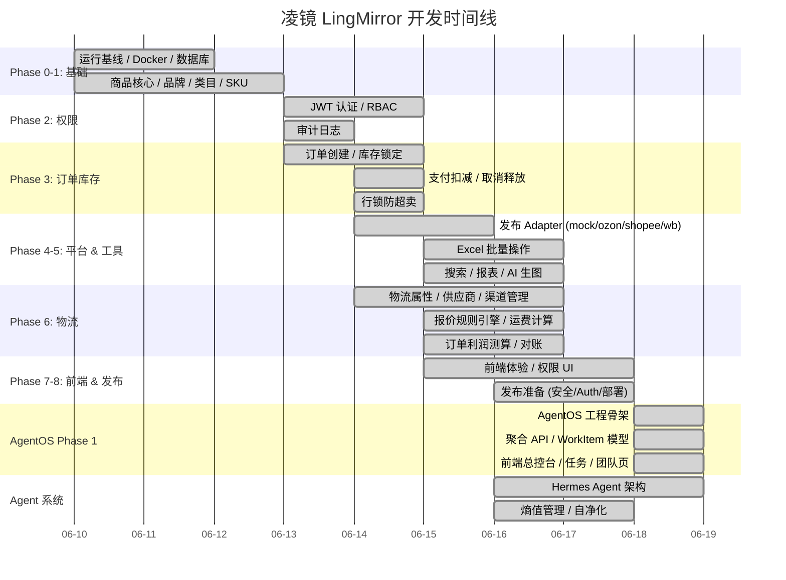

# 凌镜 LingMirror — 开发时间线

> 从原型到可用平台的演进历程。
> 最后更新：2026-06-18

---

## 2026-06-18：AgentOS Phase 1 工程骨架 ✅

新增 AI 原生运营总控台层：

| 维度 | 变化 |
|------|------|
| **后端模块** | 新增 `agentos`（schemas / service / router），4 个聚合 API |
| **数据模型** | WorkItem 统一归一化（异常/通知/Agent动作/上架任务）+ Squad + Agent 模型 |
| **前端页面** | 总控台、任务中心、Agent 团队页 + AutonomyBadge / AgentStatusCard / WorkItemCard 组件 |
| **路由** | 新增 `/agentos` 一级入口，默认进入 `/agentos/control-center` |
| **测试** | 20 个测试（归一化纯函数 11 + API 契约 9），全部通过 |
| **构建** | `npm run build` 通过，无 TypeScript 错误 |

## 2026-06-16：feat/ai-agent-framework 合并 🎉

最大单次合并（191 files）。核心架构升级：

| 维度 | 变化 |
|------|------|
| **Agent 系统** | 10 个 Agent（G1-G3, A5-A7, A1-A4），9 个 Agent 实现文件 |
| **熵值管理** | TTL 清理、预算控制、衰减调度、SPC 控制、规则健康评分 |
| **新模块 +10** | image_gen, notification, listing_task, 以及未合并的 workflow/aftersales/procurement 等 |
| **配置** | LLM / Image Gen / Replicate / RemoveBG API 配置，版本 2.0.0 |
| **前端** | 10+ 新页面、28 API 模块、26 路由模块 |

---

## 已完成里程碑



## 核心完整链路

```
商品 → SKU → 库存 → 物流报价 → 平台费用规则
  → 上架前决策 → Listing Task → 多平台发布 (mock)
  → CSV 订单导入 → 运费账单 → 平台结算
  → 利润账本 → 异常工作台 → 利润看板
  ← Agent 系统全程监控
```

## 📋 待办看板

### P0 — 下一优先

| # | 功能 | 说明 | 涉及模块 |
|---|------|------|---------|
| 1 | 🔗 **AgentOS Phase 2** | WorkItem 状态写入、审批闭环、自治升级 | `agentos`, `agent` |
| 2 | 🔗 **真实平台接入** | Ozon / Shopee 真实 API 发布 | `listing`, `listing_task` |
| 3 | 📦 **售后退货** | `paid → cancelled` 自动退库存、RMA 流程 | `order`, `aftersales` |
| 4 | 📊 **Excel 批量运营** | 批量改价、改库存、改物流属性 | `batch_ops` |

### P1 — 重要

| # | 功能 | 说明 | 涉及模块 |
|---|------|------|---------|
| 4 | 🏭 **多仓库分配** | 库存分配规则、自动分仓 | `allocation`, `inventory` |
| 5 | 📈 **报表增强** | 订单、库存、发布成功率、利润看板 | `dashboard`, `finance` |
| 6 | 🤖 **Agent 接真实数据** | Agent 分析不再用 mock 数据 | `agent` |

### P2 — 完善

| # | 功能 | 说明 |
|---|------|------|
| 7 | 前端操作按钮级权限控制 | 按 perm 隐藏/禁用 |
| 8 | Excel 导入预览 + 错误下载 | 后台通用导入组件 |
| 9 | 搜索索引优化 | 全局搜索覆盖更多类型 |
| 10 | 并发压力测试 | 库存锁定、订单创建 |
| 11 | CI migration check | GitHub Actions 自动迁移 |

### ✅ 已归档

| 阶段 | 状态 |
|------|------|
| Phase 0-8 | ✅ 全部完成 |
| Stage 11 CSV 订单导入 | ✅ 完成 |
| Stage 12 经营链路（决策→费用→分摊→报表） | ✅ 完成 |
| Stage 13 Demo Seed / Sandbox | ✅ 完成 |
| Hermes Agent 系统 | ✅ 完成（v2.0.0） |

---

## 新增功能需求

→ 新增需求请使用 `docs/features/TEMPLATE.md` 模板，放在 `docs/features/` 目录下。
