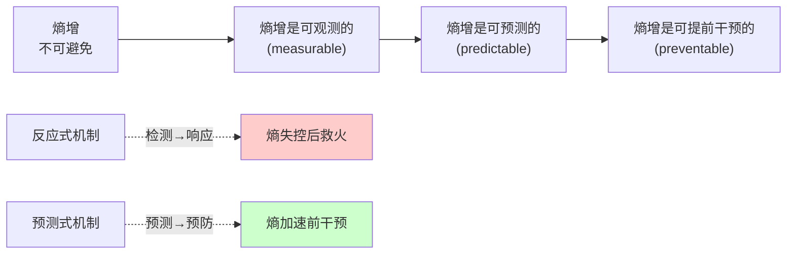
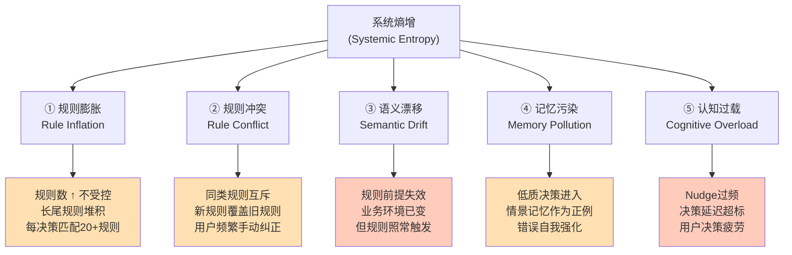
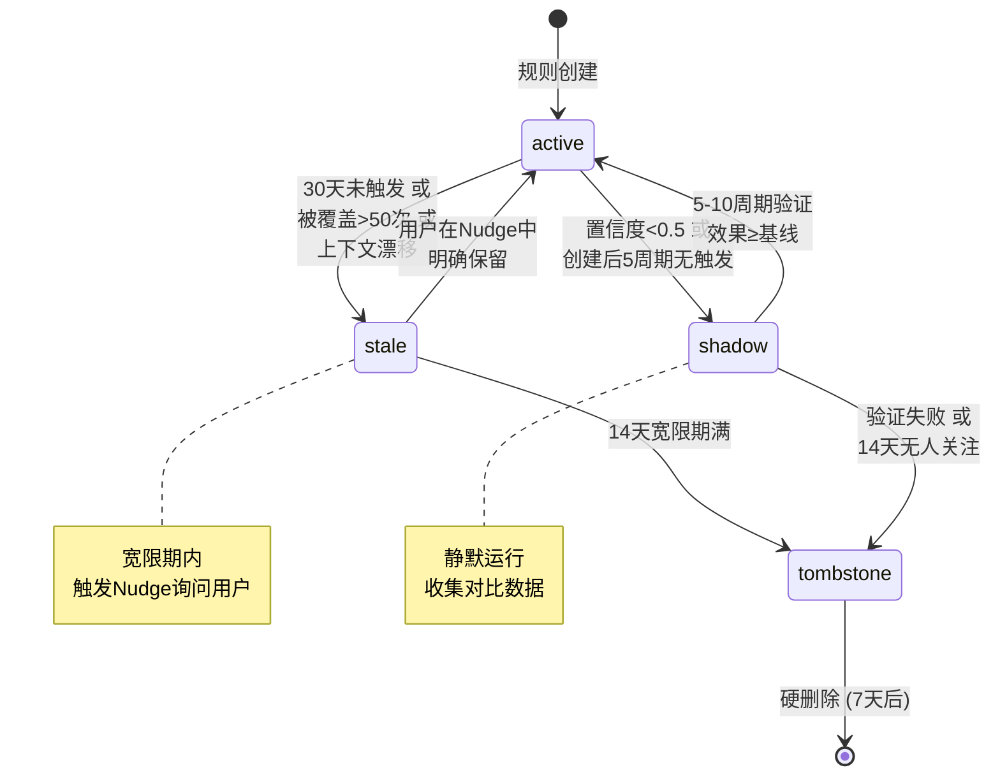
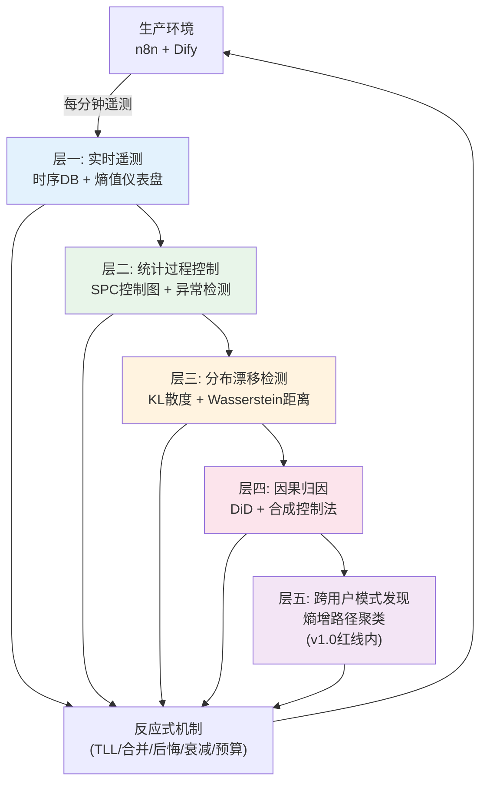
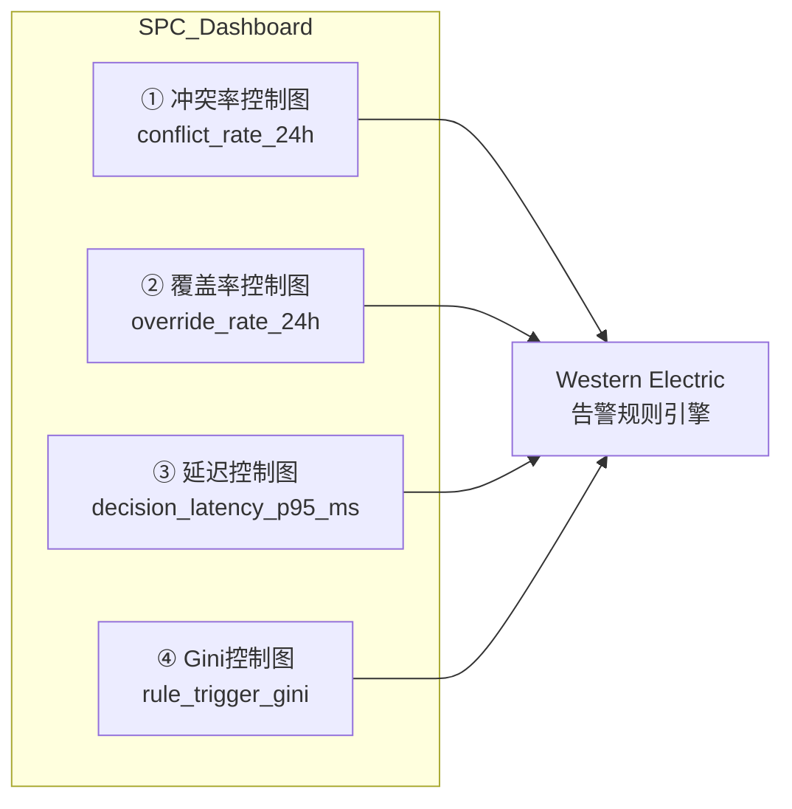
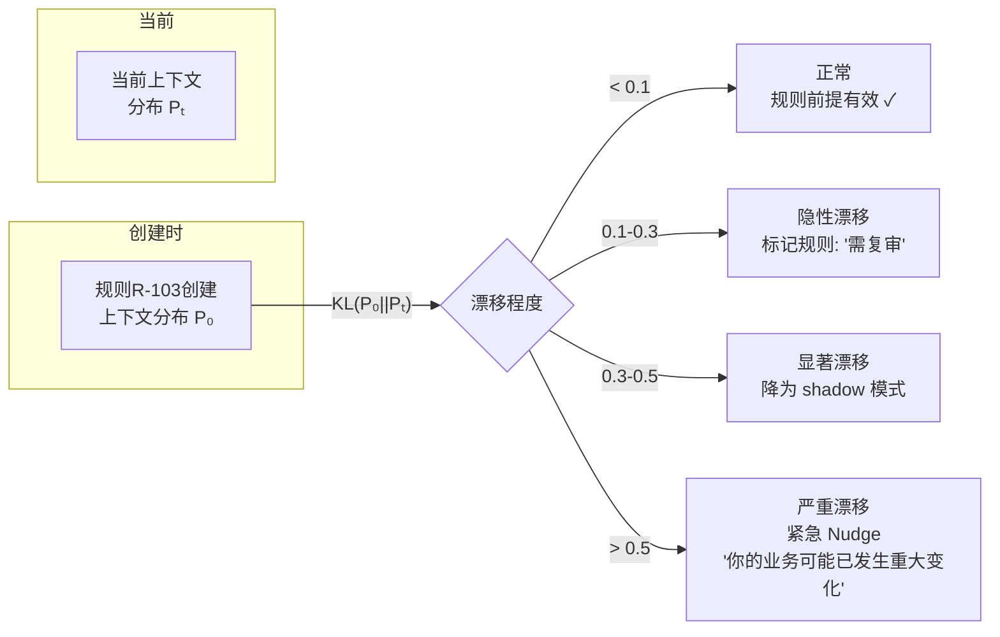
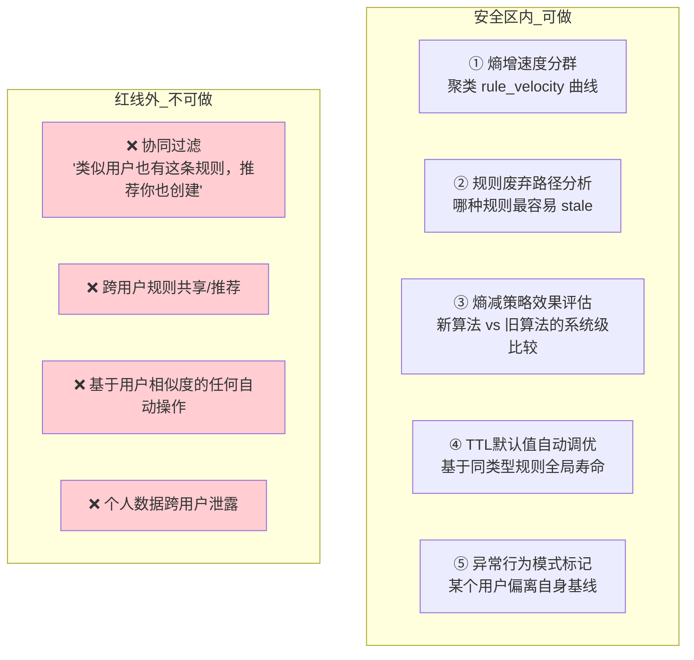
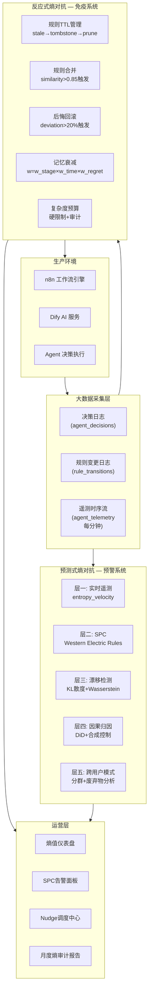
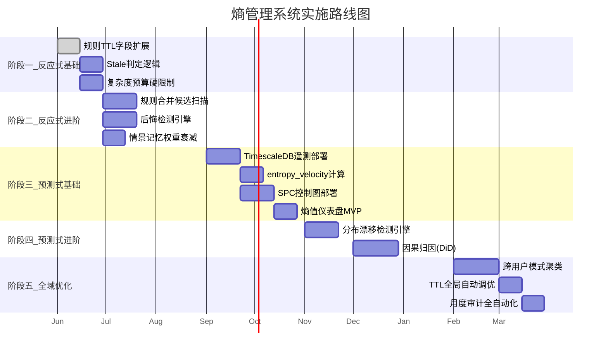

# 自进化Agent熵管理系统：从被动对抗到主动预测

> **定位**：本文档是 `hermes-self-evolving-agent-design.md` 的扩展篇，专攻自进化Agent体系中的熵增问题。将对话中讨论的所有熵对抗机制——从反应式（规则TTL、合并、后悔回滚、记忆退化、复杂度预算）到预测式（实时遥测、SPC、分布漂移检测、因果归因、跨用户模式发现）——系统化为一套完整的设计规范。
>
> **前置阅读**：`hermes-self-evolving-agent-design.md`（Hermes五柱架构、GEPA三层记忆、Honcho用户建模、四阶段进化策略、决策日志DB Schema）
>
> **版本**：v1.0 | **日期**：2026-06-17

---

## 目录

- [0. 核心洞察：熵管理从"消防"到"气象预报"](#0-核心洞察)
- [1. 熵的形式学：五种熵增形态](#1-熵的形式学)
- [2. 反应式熵对抗：五道防线](#2-反应式熵对抗)
  - [2.1 规则生命周期管理与TTL](#21-规则生命周期管理)
  - [2.2 规则合并与去重](#22-规则合并与去重)
  - [2.3 后悔驱动的规则回滚](#23-后悔驱动的规则回滚)
  - [2.4 情景记忆质量退化](#24-情景记忆质量退化)
  - [2.5 复杂度预算硬约束](#25-复杂度预算硬约束)
- [3. 大数据驱动的预测式熵对抗](#3-大数据驱动的预测式熵对抗)
  - [3.1 层一：实时遥测与熵值时间序列](#31-层一实时遥测)
  - [3.2 层二：统计过程控制（SPC）](#32-层二统计过程控制)
  - [3.3 层三：分布漂移检测](#33-层三分布漂移检测)
  - [3.4 层四：因果归因](#34-层四因果归因)
  - [3.5 层五：跨用户模式发现](#35-层五跨用户模式发现)
- [4. 熵管理闭环架构](#4-熵管理闭环架构)
- [5. 最小可行数据基础设施](#5-数据基础设施)
- [6. 实施路线图](#6-实施路线图)
- [附录：关键参考](#附录)

---

## 0. 核心洞察



**三个递进命题**：

1. **熵增不是状态切换，而是时间序列上的累积过程**——规则数量↑不可怕，规则数量的加速度↑才可怕
2. **熵增在系统的生产数据中留下可追踪的信号**——只要采集了正确维度的遥测数据
3. **引入大数据视角的本质不是"存更多数据"，而是将自省能力从"看当前状态快照"升级为"看趋势、看分布、看因果"**

**设计原则**：

| 原则 | 含义 |
|------|------|
| 生长必须伴随凋亡 | 每个新规则必有一个TTL，每条新记忆必有一个衰减函数 |
| 压缩优先于扩展 | 当两个功能可以通过合并减少50%复杂度时，触发合并 |
| 后悔是进化信号 | 每次后悔（override/reject）都是系统在说"你为我建的模型错了" |
| 复杂度预算不可逾越 | 硬限制是最后防线，熵减可以在阈值以下自动，超过则必须人工 |
| 预测优于响应 | 在规则数增长加速度为正时就干预，不要等到冲突爆发 |
| 隐私圣线不可触碰 | 跨用户分析限于模式聚类与统计参数调优，不做个体推荐 |

---

## 1. 熵的形式学

### 1.1 五种熵增形态



### 1.2 各形态的形式化定义

#### 形态一：规则膨胀（Rule Inflation）

```
定义: 个人规则库中规则数量的无上限增长

指标:
  R(t)   = 时刻 t 的活跃规则总数
  R'(t)  = dR/dt (规则增长速率)
  R''(t) = d²R/dt² (规则增长加速度)

健康态:
  R(t)↑ 且 R''(t)→0 → 系统趋于收敛，规则数接近用户业务复杂度上限

病态:
  R(t)↑ 且 R''(t)>0 → 指数膨胀，规则数呈自我加速增长

病态成因:
  · 自动提取流程过于敏感 → 每次用户微调都提取为新规则
  · Nudge 频率过高 → 用户"Yes"疲劳，大量低质规则通过
  · Honcho 模型过拟合 → 把噪声当信号
  · 模板规则与自动规则不合并 → 冗余
```

#### 形态二：规则冲突（Rule Conflict）

```
定义: 同一决策点，两条或多条规则输出互斥的动作

指标:
  conflict_rate = N_conflicting / N_total_decisions
  avg_overrides_per_decision = N_overrides / N_decisions

病态模式:
  · 同类型冲突: 规则A说降10%，规则B说降15%
  · 级联冲突: 规则A→规则B→用户覆盖→规则C再次覆盖
  · 隐性冲突: Agent输出被接受了，但用户随后手动改回（说明用户不认同但懒得纠正Nudge）

冲突来源:
  · 模板规则 vs 自动提取规则（不同来源，不同逻辑）
  · 旧规则 vs 新规则（用户偏好已变化）
  · 通用规则 vs 场景特化规则（规则覆盖域重叠）
```

#### 形态三：语义漂移（Semantic Drift）

```
定义: 规则的语义前提已经变化，但规则本身未更新

指标: 
  上下文分布的 KL 散度 vs 规则创建时的基准分布

实例:
  规则: "竞品降价 >5% 时调价幅度减半"
  创建时: 竞品降价是高频事件（占决策30%），降价均是正面竞争
  60天后: 竞品降价频率降到5%，且降价品类已切换到用户不做的品类
  → 规则在技术上仍可能触发，但前提条件（competitive landscape）已根本改变

关键洞察:
  语义漂移不是规则的错——规则本身的逻辑完美成立。
  错的是规则存在的前提条件已经过了有效期。
  这就是为什么只检查"规则有没有被触发"不够——还要检查"触发规则的上下文还对不对"。
```

#### 形态四：记忆污染（Memory Pollution）

```
定义: 低质量、过时或错误标记的决策样本进入情景记忆，
      作为后续学习和规则提取的正例，导致错误自我强化

指标:
  记忆库中 regret_marked 样本占比
  记忆库中时间衰减后权重<0.1 的样本占比

污染来源:
  · 用户犯错（手动操作失误）被Agent学习
  · 外部冲击（平台政策变化、黑天鹅事件）期间的决策被视为正常
  · 用户在不同阶段的标准不同（新品期 vs 成熟期），但老样本未分阶段管理
  · "接受了但用户不满意"的决策（accepted ≠ good）
```

#### 形态五：认知过载（Cognitive Overload）

```
定义: Agent 和用户双方的决策负荷超过阈值

对Agent:
  · 每条决策点匹配规则>20条 → 仲裁开销 ↑
  · 决策延迟 P99 > 200ms → 影响用户体验
  · 规则嵌套深度 >3 → 推理路径不可解释

对用户:
  · Nudge 话题 >3个/次 → 用户选择不读
  · Nudge 频率 >2次/天 → 用户疲劳
  · 总规则数 >200条/用户 → 用户失去对系统的心理模型
```

---

## 2. 反应式熵对抗

反应式熵对抗是在熵已经发生后的检测与纠正机制。它们是系统的基本免疫系统。

### 2.1 规则生命周期管理

#### 2.1.1 生命周期状态机



#### 2.1.2 数据库字段扩展

在现有 `personal_rules` 表基础上增加以下字段：

```sql
ALTER TABLE personal_rules ADD COLUMN last_triggered_at TIMESTAMPTZ;
ALTER TABLE personal_rules ADD COLUMN trigger_count_30d INT DEFAULT 0;
ALTER TABLE personal_rules ADD COLUMN override_count_30d INT DEFAULT 0;
ALTER TABLE personal_rules ADD COLUMN entropy_score DECIMAL(3,2) DEFAULT 0.00;
ALTER TABLE personal_rules ADD COLUMN context_embedding_snapshot VECTOR(1536);
ALTER TABLE personal_rules ADD COLUMN context_snapshot_at TIMESTAMPTZ;
ALTER TABLE personal_rules ADD COLUMN ttl_days INT DEFAULT 90;
ALTER TABLE personal_rules ADD COLUMN stale_at TIMESTAMPTZ;
ALTER TABLE personal_rules ADD COLUMN tombstone_at TIMESTAMPTZ;
ALTER TABLE personal_rules ADD COLUMN stale_reason VARCHAR(50);
ALTER TABLE personal_rules ADD COLUMN transition_log JSONB DEFAULT '[]';
```

#### 2.1.3 Stale 判定逻辑

```python
def check_rule_staleness(rule: PersonalRule) -> Optional[StaleReason]:
    """
    三条并发判定条件，任一命中即进入 stale
    """
    reasons = []
    
    # 条件1: 触发冷寂
    if rule.last_triggered_at is None:
        days_since_creation = (now() - rule.created_at).days
        if days_since_creation > 30:
            reasons.append(StaleReason.NEVER_TRIGGERED)
    elif (now() - rule.last_triggered_at).days > 30:
        reasons.append(StaleReason.TRIGGER_COLD)
    
    # 条件2: 高频覆盖
    if rule.trigger_count_30d > 0:
        override_ratio = rule.override_count_30d / rule.trigger_count_30d
        if override_ratio > 0.5 and rule.trigger_count_30d > 50:
            reasons.append(StaleReason.HIGH_OVERRIDE)
    
    # 条件3: 上下文漂移
    if rule.context_embedding_snapshot is not None:
        current_centroid = get_current_context_centroid(
            rule.user_id, rule.agent_id, rule.decision_point
        )
        drift = cosine_distance(rule.context_embedding_snapshot, current_centroid)
        if drift > 0.3:
            reasons.append(StaleReason.CONTEXT_DRIFT)
    
    if reasons:
        mark_stale(rule, reasons)
        return reasons
    return None
```

#### 2.1.4 TTL 差异化策略

不同类型和来源的规则有不同的自然寿命：

```python
DEFAULT_TTL_MAP = {
    # (rule_type, source) → TTL in days
    
    # 手动规则 — 用户显式意图，长TTL
    ('threshold', 'manual'):     180,
    ('strategy',  'manual'):     180,
    ('style',     'manual'):     365,
    ('veto',      'manual'):     365,
    
    # Nudge确认 — 对话确认过，中长TTL
    ('threshold', 'nudge'):      120,
    ('strategy',  'nudge'):      120,
    ('style',     'nudge'):      180,
    
    # 自动提取 — 高置信度 >90%
    ('threshold', 'auto_extracted'): 60,
    ('strategy',  'auto_extracted'): 60,
    ('style',     'auto_extracted'): 90,
    
    # 自动提取 — 低置信度 <90%
    ('threshold', 'auto_extracted'): 30,
    ('strategy',  'auto_extracted'): 30,
    
    # 模板 — 初始值，可变
    ('threshold', 'template'):   90,
    ('strategy',  'template'):   90,
    ('style',     'template'):   180,
}

# 动态TTL调整：
# 每次规则成功应用且未被覆盖 → TTL *= 1.1 (延长，上限2x)
# 每次规则被覆盖 → TTL *= 0.8 (缩短，下限0.5x)
```

#### 2.1.5 生命周期事件日志

```json
// personal_rules.transition_log 示例
[
  {"from":"active",  "to":"stale",    "at":"2026-05-15T02:00Z", "reason":"TRIGGER_COLD", "detail":"last_triggered 32d ago"},
  {"from":"stale",   "to":"active",   "at":"2026-05-16T09:30Z", "reason":"NUDGE_CONFIRMED", "detail":"user explicitly kept via nudge"},
  {"from":"active",  "to":"stale",    "at":"2026-07-20T02:00Z", "reason":"HIGH_OVERRIDE", "detail":"override_rate=0.62, 58 overrides in 30d"},
  {"from":"stale",   "to":"tombstone","at":"2026-08-03T02:00Z", "reason":"GRACE_EXPIRED", "detail":"14d grace period expired without action"},
]
```

### 2.2 规则合并与去重

#### 2.2.1 合并决策流程

```mermaid
flowchart TD
    A[新规则创建] --> B{同决策点已有<br/>N条规则?}
    B -->|N<3| Z[正常入库]
    B -->|N≥3| C[计算新规则与已有<br/>规则的向量相似度]
    
    C --> D{最高相似度<br/>>0.85?}
    D -->|否| Z
    D -->|是| E[标记为合并候选]
    
    E --> F[Shadow模式对比]
    F --> G{两条规则的效果<br/>差异<5%?}
    
    G -->|是| H[自动合并<br/>以置信度较高者为准]
    G -->|否| I[推送Nudge<br/>"发现相似规则可合并"]
    
    I --> J{用户响应?}
    J -->|同意| K[合并 + 记录]
    J -->|拒绝| L[两条共存<br/>标记互斥关系]
    J -->|忽略| M[14天后自动合并<br/>以置信度较高者为准]
```

#### 2.2.2 相似度计算

```python
def compute_rule_similarity(rule_a: PersonalRule, rule_b: PersonalRule) -> float:
    """
    多维加权相似度，不是简单的向量距离
    """
    # 维度1: 条件相似度 (weight=0.4)
    cond_emb_a = embed_condition(rule_a.rule_condition)
    cond_emb_b = embed_condition(rule_b.rule_condition)
    condition_sim = cosine_similarity(cond_emb_a, cond_emb_b)
    
    # 维度2: 动作相似度 (weight=0.3)
    action_emb_a = embed_action(rule_a.rule_action)
    action_emb_b = embed_action(rule_b.rule_action)
    action_sim = cosine_similarity(action_emb_a, action_emb_b)
    
    # 维度3: 触发上下文相似度 (weight=0.2)
    if (rule_a.context_embedding_snapshot is not None 
        and rule_b.context_embedding_snapshot is not None):
        context_sim = cosine_similarity(
            rule_a.context_embedding_snapshot,
            rule_b.context_embedding_snapshot
        )
    else:
        context_sim = 0.5  # 信息不足，中性
    
    # 维度4: 历史表现相似度 (weight=0.1)
    perf_a = rule_a.acceptance_rate()
    perf_b = rule_b.acceptance_rate()
    performance_sim = 1.0 - abs(perf_a - perf_b)
    
    return (
        0.4 * condition_sim + 
        0.3 * action_sim + 
        0.2 * context_sim + 
        0.1 * performance_sim
    )
```

#### 2.2.3 合并候选记录表

```sql
CREATE TABLE rule_merge_candidates (
    id              UUID PRIMARY KEY DEFAULT gen_random_uuid(),
    user_id         UUID NOT NULL,
    agent_id        VARCHAR(20) NOT NULL,
    decision_point  VARCHAR(50) NOT NULL,
    
    rule_a_id       UUID NOT NULL REFERENCES personal_rules(id),
    rule_b_id       UUID NOT NULL REFERENCES personal_rules(id),
    similarity      DECIMAL(4,3) NOT NULL,
    
    shadow_started_at TIMESTAMPTZ,
    shadow_result     JSONB,  -- {rule_a_effect, rule_b_effect, diff_pct}
    
    status          VARCHAR(20) DEFAULT 'pending',  -- pending, auto_merged, nudge_sent, merged, rejected, auto_merged_after_ignore
    
    merged_rule_id  UUID,
    
    created_at      TIMESTAMPTZ NOT NULL DEFAULT NOW(),
    resolved_at     TIMESTAMPTZ,
    
    -- 确保不重复标记
    UNIQUE(rule_a_id, rule_b_id, status)
);
```

### 2.3 后悔驱动的规则回滚

#### 2.3.1 后悔检测引擎

```python
class RegretDetector:
    """
    后悔检测的原则：
    不是"用户覆盖了规则"就算后悔，
    而是"执行结果与用户期望偏差显著"才算后悔。
    """
    
    REGRET_THRESHOLD = 0.20  # 偏差超过20%触发后悔
    
    def detect(self, decision: AgentDecision) -> Optional[RegretSignal]:
        # 仅检查被覆盖的决策
        if decision.user_action != 'modified':
            return None
        
        # Step 1: 计算原始输出与实际执行的差异
        original = decision.agent_output
        executed = decision.final_decision
        
        deviation = self._compute_deviation(original, executed)
        if deviation < self.REGRET_THRESHOLD:
            return None  # 用户只是微调，不算后悔
        
        # Step 2: 归责 — 找出导致原始输出的规则
        responsible_rules = decision.rules_applied or []
        if not responsible_rules:
            return None
        
        # Step 3: 对每一条负责的规则生成后悔信号
        signals = []
        for rule_id in responsible_rules:
            signals.append(RegretSignal(
                rule_id=rule_id,
                decision_id=decision.id,
                deviation=deviation,
                context=decision.context_json,
                user_action_taken=decision.user_overrides
            ))
        
        self._apply_regret(signals)
        return signals
    
    def _compute_deviation(self, original: dict, executed: dict) -> float:
        """
        多维度偏差计算，以广告调价为例：
        - 调价幅度偏差: |orig -10%| vs |exec -5%| → 50% 偏差
        - 方向偏差: orig=降价, exec=加价 → 100% 偏差
        - 预算偏差: orig=$50, exec=$30 → 40% 偏差
        """
        deviations = []
        
        for key in original:
            if key in executed:
                orig_val = original[key]
                exec_val = executed[key]
                
                if isinstance(orig_val, (int, float)):
                    if orig_val != 0:
                        deviations.append(abs(orig_val - exec_val) / abs(orig_val))
                elif isinstance(orig_val, str):
                    deviations.append(0.0 if orig_val == exec_val else 1.0)
        
        return max(deviations) if deviations else 0.0
```

#### 2.3.2 后悔响应策略

```python
def apply_regret_to_rule(rule: PersonalRule, regret_signal: RegretSignal):
    """
    基于后悔信号的规则降级
    """
    # 策略1: 置信度衰减
    rule.confidence *= 0.7
    
    # 策略2: 置信度跌破阈值 → 降为shadow
    if rule.confidence < 0.5:
        old_status = rule.status
        rule.status = 'shadow'
        rule.entropy_score = min(1.0, rule.entropy_score + 0.15)
        
        # Shadow 期间继续收集对比数据
        # 其他决策继续同时运行 shadow 和正式规则
        log_transition(rule, old_status, 'shadow', 
                      reason='REGRET_DOWNGRADE',
                      detail=f'confidence={rule.confidence:.3f}, deviation={regret_signal.deviation:.2f}')
    
    # 策略3: 触发 Nudge（如果同一规则连续3次后悔）
    recent_regrets = count_recent_regrets(rule.id, days=30)
    if recent_regrets >= 3:
        schedule_nudge_regret(rule, recent_regrets)
```

#### 2.3.3 Shadow 模式验证规则

```sql
CREATE TABLE rule_shadow_trials (
    id              UUID PRIMARY KEY DEFAULT gen_random_uuid(),
    rule_id         UUID NOT NULL REFERENCES personal_rules(id),
    decision_id     UUID NOT NULL REFERENCES agent_decisions(id),
    
    -- Shadow规则输出 vs 正式规则输出
    shadow_output   JSONB NOT NULL,
    formal_output   JSONB NOT NULL,
    
    -- 实际采用的决策
    actual_decision JSONB NOT NULL,
    
    -- 效果对比
    shadow_effect   DECIMAL(5,3),   -- 如果采用shadow的预期效果
    formal_effect   DECIMAL(5,3),   -- 采用正式规则的预期效果
    
    started_at      TIMESTAMPTZ NOT NULL DEFAULT NOW(),
    completed_at    TIMESTAMPTZ
);
```

### 2.4 情景记忆质量退化

#### 2.4.1 权重衰减模型

```
每个记忆样本 s 的权重由四个因子乘积决定：

  w(s) = w_stage × w_time × w_regret × w_acceptance

其中:

  w_stage:
    observation      = 0.3  ← 观察期样本，用户标准不确定
    suggestion       = 0.5  ← 建议期样本，部分被采纳
    semi_autonomous  = 0.8  ← 半自治期样本，较可靠
    full_autonomous  = 1.0  ← 全自治期样本，完全可靠
    
  w_time:
    = exp(-λ × days_since_creation)  with λ = 0.01/day
    · 1天前:    1.00 → 0.99
    · 30天前:   1.00 → 0.74
    · 90天前:   1.00 → 0.41  (不到一半权重)
    · 365天前:  1.00 → 0.03  (几乎完全遗忘)
    
  w_regret:
    regret_marked  = 0.0   ← 被后悔标记 → 从正例中移除
    not_marked      = 1.0
    
  w_acceptance:
    accepted        = 1.0
    modified        = 0.3  ← 用户改了 → 不完全可信
    rejected        = 0.0  ← 被拒绝 → 作为反例
```

#### 2.4.2 每决策点样本上限

```python
EPISODIC_SAMPLE_LIMIT_PER_DECISION_POINT = 500

def maintain_sample_budget(user_id, agent_id, decision_point):
    """
    当样本数超过上限时，按权重降序保留前500条
    """
    samples = get_all_episodic_samples(user_id, agent_id, decision_point)
    
    if len(samples) <= EPISODIC_SAMPLE_LIMIT_PER_DECISION_POINT:
        return
    
    # 按权重排序，保留Top-N
    samples_with_weight = [(s, compute_weight(s)) for s in samples]
    samples_with_weight.sort(key=lambda x: x[1], reverse=True)
    
    keep = samples_with_weight[:EPISODIC_SAMPLE_LIMIT_PER_DECISION_POINT]
    discard = samples_with_weight[EPISODIC_SAMPLE_LIMIT_PER_DECISION_POINT:]
    
    # 软删除（可恢复），不硬删除
    for sample, weight in discard:
        soft_delete_sample(sample, reason='BUDGET_EXCEEDED', weight_at_deletion=weight)
```

### 2.5 复杂度预算硬约束

#### 2.5.1 硬限制表

| 限制项 | 阈值 | 突破后行为 | 审查周期 |
|--------|:----:|-----------|:--------:|
| 单决策点匹配规则上限 | 20 条 | 只加载 Top-20（按优先级+置信度） | 实时 |
| 规则嵌套/链式深度 | 3 层 | 拒绝第4层规则触发 | 实时 |
| 决策延迟 P99 | 200ms | 触发降级（跳过规则链，直接用base模板） | 实时 |
| 单次 Nudge 话题数 | 3 个 | 只推送优先级最高的3个 | 每次Nudge |
| 每日 Nudge 次数 | 2 次 | 超出的Nudge合并到次日 | 每日 |
| 用户总规则数 | 200 条 | 触发硬性清理：自动stale最低10%的规则 | 每月 |
| 情景记忆每决策点样本数 | 500 条 | 按权重降序保留Top-500 | 每月 |
| 用户模型假设(Honcho)数 | 30 个 | 优先保留confirmed+最新的 | 每月 |

#### 2.5.2 月度全局熵审计

```python
def monthly_entropy_audit(user_id: UUID) -> AuditReport:
    """
    每月自动运行的熵审计，输出结构化报告
    """
    report = AuditReport(user_id=user_id)
    
    # 1. 规则统计
    rules = get_all_rules(user_id)
    report.total_rules = len(rules)
    report.rules_by_status = Counter(r.status for r in rules)
    report.rules_by_type = Counter(r.rule_type for r in rules)
    
    # 2. 熵增速度
    telemetry = get_telemetry_last_90d(user_id)
    report.rule_growth_rate = compute_velocity(telemetry.rule_count, window=30)
    report.rule_growth_acceleration = compute_acceleration(telemetry.rule_count, window=30)
    
    # 3. 冲突检测
    conflicts = detect_all_conflicts_30d(user_id)
    report.conflict_rate = len(conflicts) / max(1, get_decision_count_30d(user_id))
    
    # 4. 生成建议
    suggestions = []
    
    if report.rule_growth_acceleration > 0:
        suggestions.append({
            'severity': 'yellow',
            'message': f'规则增长加速度为+{report.rule_growth_acceleration:.2f}/day²，系统未收敛',
            'action': '检查自动提取阈值，考虑提高 extraction_confidence_threshold'
        })
    
    if report.conflict_rate > 0.05:
        suggestions.append({
            'severity': 'red',
            'message': f'冲突率 {report.conflict_rate:.1%} 超过5%警戒线',
            'action': '触发规则合并审计，建议人工审视高冲突决策点'
        })
    
    stale_count = report.rules_by_status.get('stale', 0)
    if stale_count > 20:
        suggestions.append({
            'severity': 'yellow',
            'message': f'stale规则数 {stale_count}，建议批量清理',
            'action': '推送Nudge: "你有多条规则超过30天未使用，是否批量清理？"'
        })
    
    report.suggestions = suggestions
    return report
```

---

## 3. 大数据驱动的预测式熵对抗

反应式机制（第2章）解决的是"熵已经发生，如何检测和纠正"。本章解决的是更高维度的问题：**能否在熵加速之前就预测到它，在系统的生产数据中找到早期预警信号？**

核心命题：熵增不是一个点，是一条曲线。不测量这条曲线的斜率和曲率，就永远只能在熵已经失控后才开始救火。



### 3.1 层一：实时遥测

#### 3.1.1 核心思想

在现有 `agent_decisions` 表之外建立一个**时序数据层**，专门回答"过去30天系统的熵走了什么轨迹"这类查询。这要求与决策日志表的查询模式完全不同的存储优化——时序数据库（TimescaleDB hypertable），而非传统的关系表。

#### 3.1.2 遥测指标体系

```
每条遥测记录的维度:

  (user_id, agent_id, decision_point, timestamp)
  
每条遥测记录的核心指标:

  ┌─────────────────────────────────────────────────┐
  │ entropy_core:                                    │
  │  · rules_active             活跃规则数            │
  │  · rules_stale              已标记stale的规则数   │
  │  · rules_shadow             影子模式规则数         │
  │  · rules_tombstone          待删除规则数          │
  ├─────────────────────────────────────────────────┤
  │ conflict_signals:                                │
  │  · conflict_rate_1h         1小时内冲突率         │
  │  · conflict_rate_24h        24小时内冲突率         │
  │  · override_rate_1h         1小时内用户覆盖率       │
  │  · override_rate_24h        24小时内用户覆盖率     │
  ├─────────────────────────────────────────────────┤
  │ performance_signals:                             │
  │  · decision_latency_p50_ms  决策延迟中位数        │
  │  · decision_latency_p95_ms  决策延迟P95           │
  │  · decision_latency_p99_ms  决策延迟P99           │
  │  · token_per_decision       每决策Token消耗       │
  │  · cache_hit_rate           KV Cache命中率        │
  ├─────────────────────────────────────────────────┤
  │ distribution_signals:                            │
  │  · rule_trigger_gini        Gini系数(规则触发不均衡度) │
  │  · rule_trigger_entropy     香农熵(规则触发分散度)  │
  │  · context_embedding_centroid   上下文embedding质心 │
  │  · context_embedding_variance   上下文embedding方差 │
  ├─────────────────────────────────────────────────┤
  │ quality_signals:                                 │
  │  · regret_rate_24h          24小时内后悔率         │
  │  · acceptance_rate_24h      24小时内采纳率         │
  │  · avg_confidence           平均置信度             │
  │  · nudge_skip_rate          用户跳过Nudge的比率    │
  └─────────────────────────────────────────────────┘

关键推导指标（不在表中存储，查询时实时计算）:

  entropy_velocity:
    · d(rules_active)/dt              规则增长率
    · d(conflict_rate_1h)/dt          冲突率变化率
    · d(decision_latency_p95_ms)/dt   延迟恶化速率
    · d(override_rate_1h)/dt          用户覆盖率上升速率
    · d(nudge_skip_rate)/dt           Nudge跳过率上升速率
    · d(rule_trigger_gini)/dt         触发集中度变化率

  entropy_acceleration:
    · d²(rules_active)/dt²            规则增长加速度
    · d²(conflict_rate_1h)/dt²        冲突率加速度
```

#### 3.1.3 数据库Schema（TimescaleDB）

```sql
-- 遥测主表 (TimescaleDB Hypertable)
CREATE TABLE agent_telemetry (
    time                TIMESTAMPTZ NOT NULL,
    user_id             UUID NOT NULL,
    agent_id            VARCHAR(20) NOT NULL,
    decision_point      VARCHAR(50) NOT NULL,
    
    -- 核心熵指标
    rules_active        INT NOT NULL DEFAULT 0,
    rules_stale         INT NOT NULL DEFAULT 0,
    rules_shadow        INT NOT NULL DEFAULT 0,
    rules_tombstone     INT NOT NULL DEFAULT 0,
    
    -- 冲突信号
    conflict_rate_1h    DECIMAL(5,4) DEFAULT 0,
    conflict_rate_24h   DECIMAL(5,4) DEFAULT 0,
    override_rate_1h    DECIMAL(5,4) DEFAULT 0,
    override_rate_24h   DECIMAL(5,4) DEFAULT 0,
    
    -- 性能信号
    decision_latency_p50_ms INT DEFAULT 0,
    decision_latency_p95_ms INT DEFAULT 0,
    decision_latency_p99_ms INT DEFAULT 0,
    token_per_decision  INT DEFAULT 0,
    cache_hit_rate      DECIMAL(4,3) DEFAULT 0,
    
    -- 分布信号
    rule_trigger_gini        DECIMAL(3,2) DEFAULT 0,
    rule_trigger_entropy     DECIMAL(5,2) DEFAULT 0,
    context_centroid         VECTOR(1536),
    context_variance         DECIMAL(8,4) DEFAULT 0,
    
    -- 质量信号
    regret_rate_24h     DECIMAL(5,4) DEFAULT 0,
    acceptance_rate_24h DECIMAL(4,3) DEFAULT 0,
    avg_confidence      DECIMAL(4,3) DEFAULT 0,
    nudge_skip_rate     DECIMAL(4,3) DEFAULT 0,
    
    -- 决策统计
    decision_count_1h   INT DEFAULT 0,
    decision_count_24h  INT DEFAULT 0,
    
    PRIMARY KEY (time, user_id, agent_id, decision_point)
);

-- 转为 hypertable，按天分片
SELECT create_hypertable('agent_telemetry', 'time',
    chunk_time_interval => INTERVAL '1 day'
);

-- 数据保留策略：原始粒度保留90天，之后自动降采样
SELECT add_retention_policy('agent_telemetry', INTERVAL '90 days');

-- 常用查询索引
CREATE INDEX idx_telemetry_user_agent_time 
    ON agent_telemetry(user_id, agent_id, time DESC);
```

#### 3.1.4 数据量估算

```
采集粒度: 每分钟1行/决策点
Agent数: 10 (A1-A7 + G1-G3)
决策点数: 平均20/Agent → 总200个决策点
每分钟行数: 200 行
每日行数: 200 × 60 × 24 = 288,000 行
年行数: ~1.05 亿行

原始数据保留: 90天 (约2600万行)
压缩率 (TimescaleDB native compression): 10-20x
实际存储占用: < 5 GB/年

结论: 完全在单机 PostgreSQL 能力范围内，不需要分布式系统。
```

#### 3.1.5 确定性区分：正常增长 vs 熵增

```python
def classify_growth_pattern(telemetry_window: List[TelemetryPoint]) -> GrowthClass:
    """
    这是层一最核心的分析：区分"健康收敛"与"熵增失控"
    """
    rule_counts = [t.rules_active for t in telemetry_window]
    times = [t.time for t in telemetry_window]
    
    # 线性回归拟合
    slope, r_squared = linear_regression(times, rule_counts)
    
    # 二次拟合求加速度
    quad_coef, _ = quadratic_regression(times, rule_counts)
    
    # 模式判别
    if slope <= 0:
        return GrowthClass.CONVERGED  # 规则数趋于或已开始下降
    
    if quad_coef <= 0:
        # 仍在增长，但加速度为负 → 趋向收敛
        if r_squared > 0.7:
            return GrowthClass.CONVERGING
        else:
            return GrowthClass.LINEAR_GROWTH
    
    # quad_coef > 0: 加速度为正 → 指数增长
    # 这是预警信号！

    # 进一步细分
    if quad_coef > 0.01:
        return GrowthClass.EXPONENTIAL_CRISIS  # 快加速，立即干预
    elif quad_coef > 0.001:
        return GrowthClass.EXPONENTIAL_WARNING  # 慢加速，需关注
    else:
        return GrowthClass.EXPONENTIAL_EARLY   # 极微加速，继续观察
```

**实例：A3 广告调价Agent的规则增长轨迹**

```
系统A（健康）:
  Week 1:  R=4,  ΔR=+4
  Week 2:  R=7,  ΔR=+3  → velocity ↓
  Week 3:  R=9,  ΔR=+2  → velocity ↓
  Week 4:  R=10, ΔR=+1  → velocity ↓
  → 二次拟合: quad_coef=-0.02 → CONVERGING ✓

系统B（熵增）:
  Week 1:  R=4,  ΔR=+4
  Week 2:  R=8,  ΔR=+4  → velocity =
  Week 3:  R=15, ΔR=+7  → velocity ↑
  Week 4:  R=28, ΔR=+13 → velocity ↑↑
  → 二次拟合: quad_coef=+0.35 → EXPONENTIAL_CRISIS ⚠️
```

---

### 3.2 层二：统计过程控制（SPC）

#### 3.2.1 核心思想

制造业的质量控制方法论直接映射到Agent系统的熵管理。Shewhart控制图的核心价值在于：**区分正常波动和异常信号**。规则数从7涨到10不一定是问题（可能是业务扩展的正常波动）；但连续7天规则触发Gini系数上升——这是长尾规则堆积的早期信号，比规则数达到硬上限早得多。

#### 3.2.2 四张控制图



#### 3.2.3 控制图参数计算

```python
class SPCMonitor:
    """
    Shewhart 控制图实现
    """
    
    def __init__(self, baseline_window_days=30):
        self.baseline_window = baseline_window_days  # 基线窗口
    
    def compute_control_limits(self, metric_series: np.ndarray):
        """
        计算上下控制限
        UCL = μ + 3σ
        CL  = μ
        LCL = μ - 3σ (若LCL<0则取0)
        """
        μ = np.mean(metric_series)
        σ = np.std(metric_series)
        
        return {
            'UCL': μ + 3 * σ,
            'CL':  μ,
            'LCL': max(0, μ - 3 * σ),
            'UWL': μ + 2 * σ,  # 上警戒限 (2σ)
            'LWL': max(0, μ - 2 * σ),  # 下警戒限 (2σ)
        }
    
    def check_western_electric_rules(self, 
                                      recent_points: List[float],
                                      control_limits: dict) -> List[Alert]:
        """
        Western Electric Rules — 工业标准异常检测规则
        
        这些规则最初由Western Electric Company在1956年制定，
        用于检测制造过程的失控状态。直接适用于Agent系统的熵监测。
        """
        alerts = []
        n = len(recent_points)
        UCL, CL, LCL = control_limits['UCL'], control_limits['CL'], control_limits['LCL']
        UWL, LWL = control_limits['UWL'], control_limits['LWL']
        
        # Rule 1: 单点超出3σ → 立即告警
        if recent_points[-1] > UCL or recent_points[-1] < LCL:
            alerts.append(Alert('RED', '单点超出3σ控制限', 'Rule-1-OutOfControl'))
        
        # Rule 2: 连续7点在中心线同侧 → 系统性偏移
        if n >= 7:
            last_7 = recent_points[-7:]
            if all(p > CL for p in last_7) or all(p < CL for p in last_7):
                alerts.append(Alert('YELLOW', '连续7点在中心线同侧', 'Rule-2-SystematicShift'))
        
        # Rule 3: 连续7点单调上升或下降 → 趋势失控
        if n >= 7:
            last_7 = recent_points[-7:]
            if all(last_7[i] < last_7[i+1] for i in range(6)):
                alerts.append(Alert('YELLOW', '连续7点单调上升', 'Rule-3-UpwardTrend'))
            elif all(last_7[i] > last_7[i+1] for i in range(6)):
                alerts.append(Alert('GREEN', '连续7点单调下降', 'Rule-3-DownwardTrend'))
        
        # Rule 4: 连续3点中有2点超出2σ → 接近失控
        if n >= 3:
            last_3 = recent_points[-3:]
            beyond_2sigma = sum(1 for p in last_3 if p > UWL or p < LWL)
            if beyond_2sigma >= 2:
                alerts.append(Alert('YELLOW', '连续3点中2点超出2σ', 'Rule-4-ApproachingLimits'))
        
        # Rule 5: 连续15点在±1σ内 →过度稳定（可能是数据采集问题）
        if n >= 15:
            sigma = (UCL - CL) / 3
            last_15 = recent_points[-15:]
            within_1sigma = sum(1 for p in last_15 if abs(p - CL) < sigma)
            if within_1sigma == 15:
                alerts.append(Alert('BLUE', '连续15点在±1σ内', 'Rule-5-OverStability'))
        
        return alerts
```

#### 3.2.4 在跨境电商 Agent 中的应用

| 控制图 | 监测指标 | Agency | Rule-3 (7点单调上升) 的含义 |
|--------|---------|--------|---------------------------|
| 冲突率 | conflict_rate_24h | A3, A5, A6 | 规则冲突正在系统性恶化，不应归于偶然 |
| 覆盖率 | override_rate_24h | 全部Agent | 用户正在系统性地纠正Agent，信任度下滑 |
| 延迟 | decision_latency_p95_ms | 全部Agent | 规则链复杂度正在逼近性能天花板 |
| Gini | rule_trigger_gini | 全部Agent | 少数规则垄断触发，大量长尾规则从不触发 → 规则膨胀前兆 |

**Rule-4（3点中2点超2σ）在跨境电商中的典型案例**：

```
A3 广告调价 Agent 的冲突率:

  Day 1: 0.023 ← 正常
  Day 2: 0.041 ← 超 2σ (UWL=0.035)
  Day 3: 0.018 ← 正常
  Day 4: 0.052 ← 超 2σ
  
  → Rule-4 触发 (Day 1-3 中 Day 2 超2σ, Day 2-4 中 Day 2和4超2σ)
  → 自动分析: 高冲突日是否与特定事件相关？
  → 发现: Day 2 和 Day 4 都是竞品大促日 → 竞品大促时冲突率飙升
  → 建议: 创建"竞品大促期间规则优先级临时覆盖"机制
```

---

### 3.3 层三：分布漂移检测

#### 3.3.1 核心思想

语义熵增（形态三）不是在规则层面发生的，而是在**决策上下文分布**层面发生的。当用户的市场从北美切换到欧洲，当品类从电子产品切换到家居，规则可能仍然有效——但规则存在的前提已经变了。层三的作用是在规则失效之前，检测到"世界已经变了"。



#### 3.3.2 漂移检测算法

```python
class DistributionDriftDetector:
    """
    使用 KL 散度和 Wasserstein 距离双指标检测上下文分布漂移
    """
    
    def __init__(self, window_size=30):
        self.window_size = window_size  # 滑动窗口大小（天）
    
    def compute_drift(self, 
                      rule: PersonalRule,
                      current_windows: List[np.ndarray]) -> DriftReport:
        """
        输入: 
          rule.context_embedding_snapshot — 规则创建时的上下文嵌入快照
          current_windows — 过去N天的上下文嵌入（每天一个质心向量）
        
        输出: 漂移报告
        """
        
        # 基线: 规则创建时的上下文分布
        baseline_emb = rule.context_embedding_snapshot
        if baseline_emb is None:
            return DriftReport(status='UNKNOWN', reason='no baseline')
        
        # Step 1: KL 散度 — 检测分布形状变化
        # 将 embedding 投影到主成分后使用核密度估计近似分布
        kl_values = []
        for day_centroid in current_windows[-7:]:  # 最近7天
            kl = self._approx_kl_divergence(baseline_emb, day_centroid)
            kl_values.append(kl)
        
        avg_kl = np.mean(kl_values)
        
        # Step 2: Wasserstein 距离 — 检测分布位置移动
        wasserstein_values = []
        for day_centroid in current_windows[-7:]:
            w_dist = self._wasserstein_1d(
                baseline_emb, day_centroid
            )
            wasserstein_values.append(w_dist)
        
        avg_wasserstein = np.mean(wasserstein_values)
        
        # Step 3: 漂移级别判定
        if avg_kl < 0.1:
            status = 'STABLE'
            action = None
        elif avg_kl < 0.3:
            status = 'MILD_DRIFT'
            action = 'MARK_FOR_REVIEW'
        elif avg_kl < 0.5:
            status = 'SIGNIFICANT_DRIFT'
            action = 'DOWNGRADE_TO_SHADOW'
        else:
            status = 'SEVERE_DRIFT'
            action = 'EMERGENCY_NUDGE'
        
        return DriftReport(
            status=status,
            action=action,
            avg_kl=avg_kl,
            avg_wasserstein=avg_wasserstein,
            affected_rules=[rule.id],
            recommendation=(
                f"规则 '{rule.rule_name}' 的上下文已漂移 {avg_kl:.2f} KL散度。"
                f"建议: {action}"
            )
        )
    
    def bulk_detect(self, 
                    rules: List[PersonalRule],
                    current_windows: List[np.ndarray]) -> Dict[UUID, DriftReport]:
        """
        批量检测某个用户-决策点下所有规则的漂移
        """
        results = {}
        for rule in rules:
            results[rule.id] = self.compute_drift(rule, current_windows)
        return results
```

#### 3.3.3 语义漂移的真实案例

```
用户: 某跨境电商运营（北美市场为主）

规则 R-45: "竞品降价 >5% → 调价幅度减半"
  创建时间: 2026-01-15
  创建时上下文分布特征:
    · 市场: 北美 85%, 欧洲 12%, 日本 3%
    · 品类: 电子产品 70%, 家居 30%
    · 竞品降价频率: 每日 8-12 条竞价变更
    · 平均订单价值: $45

─── 6个月后 (2026-07-15) ───

当前上下文分布:
  · 市场: 北美 40%, 欧洲 45%, 日本 15%
  · 品类: 电子产品 40%, 家居 50%, 宠物 10%
  · 竞品降价频率: 每日 3-5 条（欧洲市场竞争格局不同）
  · 平均订单价值: $28

KL散度: 0.47 → SIGNIFICANT_DRIFT

分析:
  规则 R-45 仍会被触发（竞品降价 >5% 的事件仍存在），
  但它的前提已经完全改变:
  · 降价主要发生在欧洲市场 → 用户在欧洲的定价策略可能不同
  · 家居品类利润结构不同于电子 → 同样的降价策略不一定适用
  · 平均订单价值降低 → 用户可能对利润率更敏感

动作:
  1. R-45 降为 shadow 模式
  2. Nudge推送给用户: "我注意到你的业务重心从北美电子转向欧洲家居，
     之前关于竞品降价的策略可能不再适用。要重新校准吗？"
```

---

### 3.4 层四：因果归因

#### 3.4.1 核心思想

现有后悔检测的问题是：只能知道"用户覆盖了规则"或"ACoS上升了"，但无法区分三种根本不同的情况：

```
情境A: 规则本身有问题
  广告ACoS超标 → 规则触发降价10% → ACoS进一步上升
  → 规则确实错了 → 应该回滚

情境B: 规则对了，但外部因素干扰
  广告ACoS超标 → 规则触发降价10% → ACoS上升
  但同一天竞品做了超级促销 → ACoS上升不是规则导致的
  → 规则可能没错 → 不应回滚

情境C: 规则是对的，效果有滞后
  广告ACoS超标 → 规则触发降价10% → ACoS短期上升(3天)
  → ACoS在第5天开始下降 → 规则最终有效
  → 规则正确，但信号被延迟 → 不应回滚
```

层四使用因果推断方法区分这三种情况，实现**精准回滚**而非**盲目回滚**。

#### 3.4.2 方法一：差分法 (Difference-in-Differences, DiD)

```python
class DiDCausalEstimator:
    """
    使用差分法估计规则的因果效应
    
    基本逻辑:
    ATT (Average Treatment Effect on the Treated) 
      = (Y_treat_post - Y_treat_pre) - (Y_control_post - Y_control_pre)
    
    其中:
    · treat: 触发规则R的广告活动
    · control: 同类决策点但未触发规则R的广告活动
    · pre: 触发前7天
    · post: 触发后7天
    """
    
    def estimate(self, 
                 rule_id: UUID,
                 decision_point: str,
                 lookback_days=7,
                 lookforward_days=7) -> CausalEstimate:
        
        # 获取触发该规则的所有决策
        treated_decisions = self._get_decisions_triggered_rule(
            rule_id, lookback_days, lookforward_days
        )
        
        # 平行宇宙：同类决策点但该规则未被触发
        control_decisions = self._get_similar_decisions_without_rule(
            decision_point, rule_id, lookback_days, lookforward_days
        )
        
        # 计算治疗效果
        results = []
        
        for treated in treated_decisions:
            # 找到最相似的控制组实例
            control = self._find_best_control(treated, control_decisions)
            if control is None:
                continue
            
            # 计算 DiD
            pre_diff = treated.metric_pre - control.metric_pre
            post_diff = treated.metric_post - control.metric_post
            att = post_diff - pre_diff
            
            results.append({
                'treated_id': treated.id,
                'control_id': control.id,
                'pre_diff': pre_diff,
                'post_diff': post_diff,
                'causal_effect': att,  # 负值=规则改善了指标
                'interpretation': self._interpret(att)
            })
        
        # 汇总
        avg_effect = np.mean([r['causal_effect'] for r in results])
        significance = self._compute_p_value(results)
        
        return CausalEstimate(
            rule_id=rule_id,
            avg_causal_effect=avg_effect,
            p_value=significance,
            n_treated=len(treated_decisions),
            n_controls_used=len(results),
            verdict='EFFECTIVE' if (avg_effect < 0 and significance < 0.05) else 'INEFFECTIVE_OR_UNCERTAIN'
        )
```

#### 3.4.3 方法二：合成控制法 (Synthetic Control)

```python
class SyntheticControlEstimator:
    """
    为每个触发规则的决策构造一个"未触发规则的平行宇宙"（合成控制）
    
    合成控制 = 加权平均"未触发规则的相似决策"
    权重通过最小化触发前7天的指标差距来确定
    """
    
    def create_synthetic_control(self, 
                                  treated_decision: dict,
                                  candidate_controls: List[dict]) -> SyntheticControl:
        
        # Step 1: 特征匹配 — 找到相似的未触发决策
        features = ['acos', 'price', 'category', 'competitor_count', 'age_days']
        
        treated_vector = np.array([treated_decision[f] for f in features])
        
        # Step 2: 通过凸优化找到最佳权重组合
        # 最小化: ||treated_pre - Σw_i × control_i_pre||²
        # 约束: Σw_i = 1, w_i ≥ 0
        weights = self._optimize_weights(
            treated_vector,
            [np.array([c[f] for f in features]) for c in candidate_controls]
        )
        
        # Step 3: 构造合成控制
        synthetic = SyntheticControl(
            treated_id=treated_decision['id'],
            control_ids=[c['id'] for c in candidate_controls],
            weights=weights,
            pre_fit_error=self._compute_pre_fit_error(treated_vector, weights, candidate_controls)
        )
        
        # Step 4: 外推：在触发后期间，实际 vs 合成控制的差距
        # 差距 = treated_post - Σw_i × control_i_post
        # 如果实际表现显著差于合成控制 → 规则造成了负面影响
        
        return synthetic
```

#### 3.4.4 因果归因输出示例

```json
{
  "rule_id": "r-103",
  "rule_name": "竞品降价时调价幅度减半",
  "analysis_date": "2026-06-17",
  "sample_size": 47,
  
  "did_results": {
    "avg_causal_effect": -0.023,
    "interpretation": "规则平均降低ACoS 2.3个百分点",
    "p_value": 0.003,
    "verdict": "EFFECTIVE"
  },
  
  "heterogeneity_analysis": {
    "effective_triggers": 40,
    "harmful_triggers": 7,
    "harmful_conditions": [
      "广告活动年龄 < 30天: 5/7 有害触发",
      "竞品降价幅度 > 20%: 2/7 有害触发"
    ],
    "suggestion": "添加条件门控: ad_age_days >= 30 AND competitor_drop_pct < 20"
  },
  
  "synthetic_control_summary": {
    "avg_gap_vs_synthetic": -0.018,
    "interpretation": "实际ACoS比合成控制低1.8pp，规则有效"
  },
  
  "action": "KEEP_WITH_REFINEMENT",
  "refinement": {
    "add_condition": {
      "field": "ad_age_days",
      "operator": ">=",
      "value": 30
    }
  }
}
```

#### 3.4.5 因果归因的数据需求

```
最低数据需求（每个决策点）:
  · 至少 50 个"规则触发"决策样本（实验组）
  · 至少 100 个"同等条件但未触发"的决策样本（对照组）
  · 每个样本需要前后各 7 天的指标窗口
  · 总数据窗口: 至少 1-2 个月

这就是为什么需要"大数据"——不是"大"在绝对量上，
而是"足够产生因果推断所需的变化量"。
```

---

### 3.5 层五：跨用户模式发现

#### 3.5.1 v1.0 安全边界

跨用户分析是最敏感的层次。在 v1.0 中严格遵守以下边界：



#### 3.5.2 熵增速度分群

```python
class EntropyVelocityClustering:
    """
    不碰个体规则内容，只分析 rule_velocity 时间序列的模式
    """
    
    def cluster_users_by_entropy_trajectory(self, 
                                             user_velocities: Dict[UUID, np.ndarray]):
        """
        对用户/Agent的规则增长曲线进行聚类
        
        发现三类模式:
          A型（快速收敛）: 3周内规则数稳定 → 系统健康
          B型（缓慢增长）: 持续线性增长 → 需关注
          C型（指数膨胀）: 加速度为正 → 需主动干预
        """
        
        # 提取特征：前4周的 rule_velocity 序列
        features = []
        for uid, velocities in user_velocities.items():
            features.append({
                'user_id': uid,
                'week1_velocity': velocities[0],
                'week2_velocity': velocities[1],
                'week3_velocity': velocities[2],
                'week4_velocity': velocities[3],
                'acceleration': velocities[3] - velocities[0],
                'total_rules': sum(velocities),
            })
        
        # K-Means 聚类 (K=3)
        from sklearn.cluster import KMeans
        X = np.array([[f['total_rules'], f['acceleration']] for f in features])
        kmeans = KMeans(n_clusters=3, random_state=42)
        labels = kmeans.fit_predict(X)
        
        # 标记聚类
        cluster_profiles = {}
        for i in range(3):
            mask = labels == i
            avg_acc = X[mask, 1].mean()
            if avg_acc <= 0:
                profile = 'TYPE_A_CONVERGING'
            elif avg_acc < 1.0:
                profile = 'TYPE_B_LINEAR'
            else:
                profile = 'TYPE_C_EXPONENTIAL'
            cluster_profiles[i] = profile
        
        return {
            'labels': labels,
            'profiles': cluster_profiles,
            'type_transitions': self._detect_type_transitions(user_velocities, labels)
        }
    
    def _detect_type_transitions(self, 
                                  velocities: Dict[UUID, np.ndarray],
                                  labels: np.ndarray) -> List[TransitionAlert]:
        """
        检测用户是否从一种类型滑向另一种类型
        
        例如: 某个Agent从 A型(收敛) 滑向 B型(线性增长)
        → 预判性告警
        """
        alerts = []
        for i, (uid, vels) in enumerate(velocities.items()):
            # 将4周分成两段
            first_half = vels[:2].mean()
            second_half = vels[2:].mean()
            
            if second_half > first_half * 1.5:
                alerts.append(TransitionAlert(
                    user_id=uid,
                    from_profile='CONVERGING/LINEAR',
                    to_profile='ACCELERATING',
                    delta=second_half - first_half,
                    recommendation='建议提前审核该用户的规则库，预判性熵减'
                ))
        
        return alerts
```

#### 3.5.3 规则废弃物全局分析

```python
def analyze_rule_retirement_patterns(all_rules_across_users: List[PersonalRule]):
    """
    分析全局范围内哪种类型的规则最容易变成 stale
    
    这是"不用个体数据做推荐"的范例：
    不做 "User A的规则推荐给User B"
    只做 "全局来看threshold类型规则的TTL中位值是90天，strategy是150天"
    → 用于系统级默认参数调优
    
    隐私保护: 只输出聚合统计，不输出个体数据
    """
    
    retired_rules = [r for r in all_rules_across_users 
                     if r.status in ('stale', 'tombstone')]
    
    # 按规则类型和来源分组的寿命统计
    import pandas as pd
    df = pd.DataFrame([{
        'rule_type': r.rule_type,
        'source': r.source,
        'lifetime_days': (r.stale_at - r.created_at).days if r.stale_at 
                          else (now() - r.created_at).days,
        'was_overridden': r.override_count_30d > 0,
    } for r in retired_rules])
    
    summary = df.groupby(['rule_type', 'source']).agg({
        'lifetime_days': ['median', 'mean', 'std', 'count'],
        'was_overridden': 'mean'
    })
    
    # 输出建议
    suggestions = []
    for (rule_type, source), row in summary.iterrows():
        median_life = row[('lifetime_days', 'median')]
        current_ttl = DEFAULT_TTL_MAP.get((rule_type, source), 90)
        
        if median_life < current_ttl * 0.7:
            suggestions.append({
                'rule_type': rule_type,
                'source': source,
                'current_ttl': current_ttl,
                'suggested_ttl': int(median_life * 1.2),  # 留20% buffer
                'reason': f'实际中位寿命{median_life}天，远低于当前TTL{current_ttl}天'
            })
    
    return {
        'lifetime_summary': summary,
        'ttl_adjustment_suggestions': suggestions
    }
```

---

## 4. 熵管理闭环架构

### 4.1 全景架构图



### 4.2 从检测到行动的决策矩阵

| 信号来源 | 信号 | 严重度 | 自动/人工 | 动作 |
|---------|------|:------:|:--------:|------|
| 遥测-velocity | 规则增长加速度 > 0.001 | YELLOW | 自动 | 提高自动提取阈值（+0.05） |
| 遥测-velocity | 规则增长加速度 > 0.01 | RED | 自动+Nudge | 标记最低置信度10%的规则 → stale |
| SPC Rule-1 | 单点超出3σ | RED | 自动 | 立即降级受影响规则 |
| SPC Rule-2 | 连续7点同侧 | YELLOW | 自动 | 标记该决策点所有规则为"需复审" |
| SPC Rule-3 | 连续7点上升 | YELLOW | Nudge | "检测到规则冲突率/延迟/覆盖率趋势上升" |
| 漂移检测 | KL散度 0.3-0.5 | YELLOW | 自动 | 降为shadow |
| 漂移检测 | KL散度 > 0.5 | RED | Nudge | "你的业务环境似乎发生了重大变化" |
| 因果归因 | 有害触发>15% | YELLOW | 自动 | 添加条件门控建议 |
| 因果归因 | 净效应无统计显著性 | YELLOW | Nudge | "这条规则的效果不确定，是否保留？" |
| 跨用户 | 用户从A型滑向B型 | YELLOW | 自动 | 生成预判性熵减建议，列入下次审计 |
| 月度审计 | 总规则数>180 | YELLOW | Nudge | 推送批量清理建议 |
| 月度审计 | 总规则数>200 | RED | 自动+Nudge | 硬清理最低10% + 通知用户 |

### 4.3 Cron 调度表

```python
ENTROPY_CRON_SCHEDULE = {
    # 实时
    'every_minute': [
        'collect_telemetry',           # 采集遥测数据
        'check_spc_rules',             # SPC异常检测
    ],
    
    # 每日 (UTC 02:00)
    'daily': [
        'compute_entropy_velocity',    # 计算熵增速度
        'check_rule_staleness',        # 规则TTL检查
        'detect_distribution_drift',   # 分布漂移检测
        'update_entropy_scores',       # 更新规则熵值评分
    ],
    
    # 每周 (周一 UTC 02:00)
    'weekly': [
        'run_rule_consolidation_scan', # 规则合并候选扫描
        'run_regret_analysis',         # 后悔模式分析
        'prune_episodic_memory',       # 情景记忆预算维护
        'run_spc_baseline_recalc',     # SPC控制限重新计算
    ],
    
    # 每月 (1日 UTC 02:00)
    'monthly': [
        'run_causal_attribution',      # 完整因果归因分析
        'run_cross_user_pattern',      # 跨用户模式发现
        'generate_monthly_audit',      # 月度熵审计报告
        'update_ttl_defaults',         # TTL默认值全局调优
        'check_complexity_budget',     # 复杂度预算合规检查
    ],
}
```

---

## 5. 数据基础设施

### 5.1 最小可行架构

```
┌──────────────────────────────────────────────┐
│              PostgreSQL 16+                   │
│ ┌────────────────────────────────────────┐   │
│ │  agent_decisions (决策日志主表)          │   │
│ │  personal_rules (个人规则库 + 熵字段)     │   │
│ │  rule_conflicts (规则冲突日志)           │   │
│ │  rule_shadow_trials (Shadow对比数据)     │   │
│ │  rule_merge_candidates (合并候选)        │   │
│ │  agent_episodes (Episode汇总)           │   │
│ │  honcho_user_profiles (用户模型)         │   │
│ ├────────────────────────────────────────┤   │
│ │  扩展: pgvector (上下文embedding)        │   │
│ └────────────────────────────────────────┘   │
│                                                │
│ ┌────────────────────────────────────────┐   │
│ │  TimescaleDB Extension                  │   │
│ │  agent_telemetry (遥测时序表)           │   │
│ │  - Hypertable (按天分片)                │   │
│ │  - 自动压缩 (chunk压缩)                 │   │
│ │  - 自动降采样 (连续聚合)                │   │
│ │  - 90天保留策略                         │   │
│ └────────────────────────────────────────┘   │
└──────────────────────────────────────────────┘

不需要: Hadoop, Spark, Flink, Kafka
不需要: 分布式数据库集群
不需要: 实时流处理框架（每分钟1次批量采集就够了）

单机 PostgreSQL (16GB RAM + 100GB SSD) 完全满足
年均数据增量 < 10 GB
```

### 5.2 降采样策略（连续聚合）

```sql
-- 每日聚合视图（保留365天）
CREATE MATERIALIZED VIEW agent_telemetry_daily AS
SELECT
    time_bucket('1 day', time) AS day,
    user_id,
    agent_id,
    decision_point,
    
    -- 熵指标日汇总
    AVG(rules_active)          AS avg_rules_active,
    MAX(rules_active)          AS max_rules_active,
    AVG(rules_stale)           AS avg_rules_stale,
    
    -- 冲突率日汇总
    AVG(conflict_rate_24h)     AS avg_conflict_rate,
    MAX(conflict_rate_24h)     AS max_conflict_rate,
    AVG(override_rate_24h)     AS avg_override_rate,
    
    -- 延迟日汇总
    AVG(decision_latency_p95_ms) AS avg_p95_latency,
    MAX(decision_latency_p99_ms) AS max_p99_latency,
    
    -- 采纳率日汇总
    AVG(acceptance_rate_24h)   AS avg_acceptance_rate,
    AVG(nudge_skip_rate)       AS avg_nudge_skip_rate,
    
    -- 决策量
    SUM(decision_count_24h)    AS total_decisions
FROM agent_telemetry
GROUP BY day, user_id, agent_id, decision_point;

-- 自动刷新
SELECT add_continuous_aggregate_policy('agent_telemetry_daily',
    start_offset    => INTERVAL '2 days',
    end_offset      => INTERVAL '1 hour',
    schedule_interval => INTERVAL '1 hour'
);
```

### 5.3 监控自有熵值

系统自身的熵也需要监控：

```sql
CREATE TABLE system_self_monitoring (
    time        TIMESTAMPTZ NOT NULL DEFAULT NOW(),
    
    -- 数据库健康
    db_size_bytes           BIGINT,
    telemetry_rows_total    BIGINT,
    telemetry_chunk_count   INT,
    
    -- 熵管理性能
    staleness_check_duration_ms     INT,
    drift_detection_duration_ms     INT,
    causal_attribution_duration_ms  INT,
    monthly_audit_duration_ms       INT,
    
    -- Cron健康
    cron_last_success_at    TIMESTAMPTZ,
    cron_failures_24h       INT DEFAULT 0,
    
    -- 告警统计
    spc_alerts_24h          INT DEFAULT 0,
    drift_alerts_24h        INT DEFAULT 0,
    nudge_queue_size        INT DEFAULT 0
);
```

---

## 6. 实施路线图

### 6.1 分阶段部署策略



### 6.2 各阶段关键交付物

| 阶段 | 时间 | 关键交付物 | 用户可感知价值 |
|------|------|-----------|-------------|
| P1: 反应式基础 | M1-M2 | TTL stale自动标记、复杂度预算硬限制 | "Agent不会越来越臃肿" |
| P2: 反应式进阶 | M2-M4 | 规则自动合并、后悔回滚、记忆自动衰减 | "规则自动精简，不需要我手动管理" |
| P3: 预测式基础 | M4-M6 | 遥测仪表盘、SPC告警、熵增速度可视化 | "可以看到Agent的'健康指数'" |
| P4: 预测式进阶 | M6-M9 | 语义漂移预警、因果归因 | "Agent主动告诉我'你的业务变了，策略需要更新'" |
| P5: 全域优化 | M9-M12 | 跨用户模式、TTL自动调优、全自动审计 | "系统自己优化自己，我不需要操心" |

### 6.3 从"消防队"到"气象台"的转型路径

```
阶段一+二（反应式 = 消防队）:
  熵已经着火 → 检测 → 灭火 → 防止复燃
  用户感知: "Agent 会自动清理旧规则，不会越来越乱"

阶段三（预测式基础 = 天气预报）:
  采集气压/湿度/风速（遥测） → 建立气象模型（SPC）
  → 发布预警（"未来3天内冲突率可能上升"）
  用户感知: "Agent 告诉我哪里可能出问题"

阶段四（预测式进阶 = 气候研究）:
  分析大气环流（漂移） → 追踪气团运动（因果）
  → 理解为什么"竞品降价时你的策略需要调整"
  用户感知: "Agent 不只是预警，还会解释为什么"

阶段五（全域优化 = 气候治理）:
  跨区域数据对比（跨用户） → 发现气候变化模式
  → 自动调整治理策略（TTL全局调优）
  用户感知: "系统越来越好用，但我完全不需要管理它"
```

---

## 附录

### A. 关键公式汇总

```
规则权重衰减:
  w(s) = w_stage × w_time × w_regret × w_acceptance
  w_stage ∈ {0.3, 0.5, 0.8, 1.0}
  w_time = exp(-0.01 × days_since_creation)
  w_regret ∈ {0.0, 1.0}
  w_acceptance ∈ {0.0, 0.3, 1.0}

规则相似度:
  sim(A,B) = 0.4 × cosine(cond_A, cond_B) 
           + 0.3 × cosine(action_A, action_B)
           + 0.2 × cosine(ctx_A, ctx_B)
           + 0.1 × (1 - |perf_A - perf_B|)

SPC控制限:
  UCL = μ + 3σ,  CL = μ,  LCL = max(0, μ - 3σ)

因果效应 (DiD):
  ATT = (Y_treat_post - Y_treat_pre) - (Y_control_post - Y_control_pre)

KL散度（近似）:
  D_KL(P||Q) ≈ (1/2) × (tr(Σ_Q⁻¹Σ_P) + (μ_Q-μ_P)ᵀΣ_Q⁻¹(μ_Q-μ_P) - d + ln(|Σ_Q|/|Σ_P|))

规则生命周期状态转移:
  active → stale (3条并发条件任一命中)
  stale → tombstone (14天宽限)
  stale → active (Nudge确认保留)
  shadow → active (5-10周期验证通过)
  shadow → tombstone (验证失败)
```

### B. 与主文档的集成

本文档中新增的数据库表和字段是 `hermes-self-evolving-agent-design.md` 第14章（决策日志DB Schema）的扩展。具体集成点：

| 本文档表/字段 | 集成到主文档位置 |
|-------------|----------------|
| `agent_telemetry` | 新增第14.6节 |
| `personal_rules` 扩展字段（TTL/熵值） | 扩展第14.2节 |
| `rule_shadow_trials` | 新增第14.7节 |
| `rule_merge_candidates` | 新增第14.8节 |
| `system_self_monitoring` | 新增第14.9节 |
| 遥测采集Cron | 扩展第6节 Nudge机制 |
| 熵减自动动作 | 扩展第10节 四类可学习信号 |

### C. 关键参考

- [NousResearch Hermes Agent](https://github.com/NousResearch/hermes-agent) - Hermes五柱架构
- [Statistical Process Control - Western Electric Rules](https://en.wikipedia.org/wiki/Western_Electric_rules) - SPC控制图理论
- [Difference-in-Differences Estimation](https://en.wikipedia.org/wiki/Difference_in_differences) - 因果推断方法
- [Synthetic Control Method](https://en.wikipedia.org/wiki/Synthetic_control_method) - 合成控制法
- [TimescaleDB Documentation](https://docs.timescale.com/) - 时序数据库
- [pgvector](https://github.com/pgvector/pgvector) - PostgreSQL向量扩展
- [KL Divergence and Distribution Shift](https://en.wikipedia.org/wiki/Kullback%E2%80%93Leibler_divergence) - 分布漂移度量

---

> **文档结束**
>
> **一句话总结**: 大数据对抗熵增的本质不是"存更多数据"，而是**把系统的自省能力从"看当前状态快照"升级为"看趋势（速度）、看分布（漂移）、看因果（反事实）"**。熵增不是一个点，是一条曲线；不测量这条曲线的斜率和曲率，就永远只能在熵已经失控后才开始救火。
>
> **与主文档的关系**: 本文档是 `hermes-self-evolving-agent-design.md` 的熵管理扩展篇。主文档定义了"Agent如何成长"；本文档定义了"Agent如何确保成长的方向是对的"。
