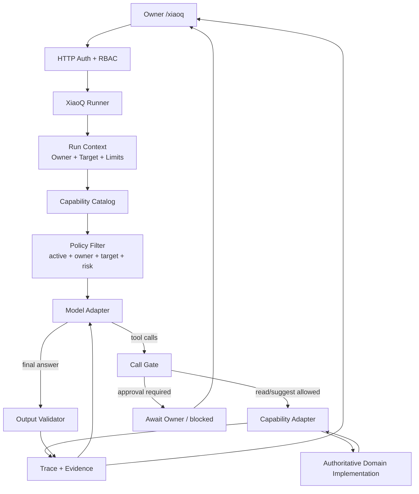

# 小Q Agent Runtime Architecture v1

> 日期：2026-07-13
> 状态：需求案件第一湖 `implemented / automated_verified`；真实 Provider 人工验收仍为 `unknown`
> 唯一 Agent：`xiao_q`
> 产品范围：Owner 本人使用的完整 AI 跨境电商经营平台
> 权威上位决策：[ADR-001](../decisions/ADR-001-owner-complete-commerce-platform.md)
> 能力治理：[小Q Capability Contract](../governance/XIAOQ_CAPABILITY_CONTRACT.md)

## 1. 结论

凌镜只建设一个面向 Owner 的经营 Agent：小Q。

第一版正式架构不是新的通用 AgentOS，也不是在旧 A1—A12、G0—G3 上继续叠加。它由三部分组成：

1. 一个由模型控制下一步的、有限且可停止的运行循环；
2. 一个只暴露当前 Owner、当前对象和当前风险允许能力的目录；
3. 一套完全位于模型之外的事实、权限、审批、审计、幂等和领域状态控制。

```text
Owner 问题
→ 服务端确定 Owner、目标对象和本次可见能力
→ 模型选择能力或直接回答
→ 服务端重新校验并执行领域 implementation
→ 结果与证据返回模型
→ 模型继续选择、回答或停止
→ 高风险动作暂停并交还 Owner
```

需求案件路径已经实际运行上述“模型选择 → 工具结果 → 模型继续判断”循环，响应模式为 `agent_runtime_v1`。其他 `target_type` 仍是固定领域读取加单次模型回答，只能称为已实现的 AI 辅助工作流，不能据此宣称小Q全领域均已迁入 Agent Runtime。

## 2. 事实基线

### 2.1 `actual / implemented`

- 小Q稳定 ID、Owner入口、HTTP路由、页面和 Capability Contract 已存在。
- 已登记需求案件、事实案卷、1688受控草稿、订单经营事实和经营决定建议等只读或建议能力。
- `demand_case` 已由模型在两个只读工具中选择，真实结果回灌模型后继续回合；其他目标仍由代码固定读取。
- `ai.LLMProvider` 已统一表达文本、结构化工具定义、工具调用和工具结果消息；OpenAI-compatible 与 Anthropic 协议映射已有自动测试。
- `internal/domain/xiaoq/agent_runtime.go` 已实现 Owner/Target 绑定的 Capability Catalog、严格参数校验、顺序执行、一次参数纠正机会、回合/工具/Token/时间上限和取消语义。
- 最终输出必须是`answer / needs_evidence`结构并引用真实成功的tool call ID；没有成功引用的事实性回答会被阻断。
- `/api/v1/xiao-q/messages` 保持兼容；需求案件真实 Provider 返回 `agent_runtime_v1`，开发 stub 保持 `mock/read_only_v1`。
- `/xiaoq/traces/:traceId` 已提供 Owner 隔离的只读回放页面。
- Trace 已能保存一次运行、顺序事件、证据引用、最终输出和Token等信息。
- Command、ToolBridge、RBAC、Approval、Audit、幂等与领域状态机已有可复用 implementation。
- 旧 A/G Agent 大多是确定性规则、查询、公式或固定工作流；其生产定时任务、DAG、MoA、自治升级和写路由已停止注册，旧 Orchestrator在共享入口失败关闭，历史Trace/Action只读保留。
- 小Q产品 Runtime 使用 required-real-provider 构造器：任何环境缺少真实 Provider 或 API Key 都明确禁用，绝不回退 `stub`；`GET /api/v1/xiao-q/identity` 返回当前 Provider 可用性。
- 真实 Provider 人工验收只有一个显式付费入口：在本地设置 `LLM_PROVIDER`、`LLM_API_KEY`（可选 `LLM_MODEL`/`LLM_BASE_URL`）后，以 `XIAOQ_REAL_PROVIDER_ACCEPTANCE=I_ACCEPT_ONE_PAID_XIAOQ_TEST go test -run TestRealProviderAcceptance -v ./internal/domain/xiaoq` 执行。验收包装器最多调用 Provider 2 次、每次最多输出 400 tokens，且必须完成真实工具读取、证据引用和 Trace。
- AIOS Runtime 主要管理注册、生命周期、心跳和资源计数，不是模型工具循环。

### 2.2 `planned`

- 一次受预算授权的真实模型只读纵向人工验收与固定评估集。
- 将1688、exact order经营事实和经营决定建议逐湖迁入同一Runner。
- 旧 A/G/AIOS 的逐项迁移和删除。

### 2.3 `unknown`

- 真实 Provider 对 Owner 中文经营问题的工具选择正确率、费用和稳定性（尚未进行付费人工调用）。
- Agent循环能否降低 Owner 的查询、拼接和核验时间。
- 真实经营数据下的回答准确性、成本和延迟。
- 生产外部写入恢复与真实回执对账能力。

## 3. 目标与非目标

### 3.1 目标

- 让模型在受控范围内决定下一步，而不是由代码写死完整流程。
- 让每次能力调用都对应真实执行、真实结果和真实 Trace。
- 继续以领域事实和状态机为权威；模型输出默认保持 `inferred`。
- 使一个深 Runner module 支撑全部领域，形成高 leverage 和高 locality。
- 按 ADR-001 的纵向单元逐步覆盖完整 Owner 经营平台。

### 3.2 非目标

- 不建设第二个 Owner-facing Agent。
- 不建设 Multi-Agent、MoA、Agent Teams、A2A 或 Agent市场。
- 不引入 LangGraph、CrewAI、AutoGen、Python sidecar 或新的通用工作流平台。
- 不让模型执行任意 SQL、Shell、HTTP 或浏览器动作。
- 不在第一湖建设长期记忆、向量数据库、Reflection、Tree of Thoughts 或自主规划器。
- 不因为模型能够提出动作，就扩大它的批准和执行权限。

## 4. 总体架构



模型只控制图中的两件事：

1. 在已过滤能力中选择调用什么；
2. 根据返回结果决定继续调用还是生成回答。

模型不控制 Owner身份、对象归属、能力可见性、风险分类、审批要求、事实等级、幂等、外部回执或领域状态迁移。

## 5. Module 与 seam

### 5.1 `XiaoQ Runner`：唯一外部 seam

Runner 是深 module。HTTP handler、测试和未来调度入口只需要理解一个主要 interface：

```go
Run(ctx context.Context, request RunRequest) (RunResult, error)
```

`RunRequest` 只包含：

- Owner身份由认证上下文注入，不接受请求体声明；
- Owner问题；
- 一个明确 primary Target；
- 可选的会话/客户端幂等标识；
- 服务端选择的运行模式。

Runner implementation 隐藏：能力发现、模型回合、工具调用、错误转换、停止条件、Trace和输出验证。调用者不参与循环细节。

### 5.2 `Model Adapter` seam

现有文本 Provider 需要演进为可以表达一个模型回合：

```text
输入：instructions + messages + visible tool definitions + limits
输出：final message 或 structured tool calls + usage + finish reason
```

这是一个真实 seam，因为 OpenAI-compatible、Anthropic和测试 scripted model 至少有三个 adapter。Provider adapter 只负责协议映射，不负责权限、工具执行或经营裁决。

第一版不同时维护“文本模型接口”和“Agent模型接口”两套长期主路径。实施期间允许短暂兼容，迁移完成后普通文本回答也通过同一模型回合表示。

### 5.3 `Capability Catalog`：唯一模型可见目录

Catalog 是第二个深 module，interface 只承担两类行为：

```text
VisibleFor(run_context) → tool definitions
Call(validated_call) → capability result
```

implementation 隐藏：

- active/deferred/disabled状态；
- Owner和Target匹配；
- JSON Schema校验；
- 风险与权限；
- 超时与重试规则；
- 领域 adapter 调用；
- Evidence提取、脱敏与事实等级保持；
- 调用前后 Trace。

Catalog 以 `internal/domain/xiaoq/` 下的 Capability 为权威，不把旧 `ai.AgentRegistry` 或 `aios/toolregistry` 作为第二个模型可见目录。

### 5.4 `Capability Adapter` seam

每个 adapter 必须调用现有权威领域 implementation，例如按 Owner读取需求案件、经营事实视图或经营决定案卷。它不能直接查询任意业务表，也不能复制领域状态规则。

一个模型可见 Capability 必须对应一次真实、可单独验证的调用。不能像当前经营事实路径那样只执行一次聚合读取，却在 Trace 中伪装成七次独立能力调用。需要聚合时，应登记一个诚实的深能力，例如 `order.operating_view.read`；需要独立选择时，才拆成多个真实能力。

### 5.5 `Call Gate`：模型外强制控制

每次模型返回工具调用后，Call Gate 必须重新验证：

1. capability ID和版本在本次 visible集合中；
2. 参数通过严格 JSON Schema，拒绝未知字段；
3. Owner、Target和资源版本仍然有效；
4. 风险、权限和执行模式允许；
5. 调用数量、时间和预算尚未超限；
6. suggest/mutate调用包含所需幂等键；
7. 需要审批时不执行，返回 `awaiting_owner` 或 `blocked`。

Prompt或工具描述永远不能代替这些检查。

### 5.6 `Trace Recorder`：复用现有 seam

第一湖复用现有 `TraceRecorder` 与 AI trace表，不新建第二套 Run数据库。每次运行至少记录：

```text
run/trace id
owner id
target type/id/version
model/provider/prompt version
visible capability ids/versions
turn started/completed
tool requested/allowed/denied
validated argument hash
capability result status
evidence refs and truth status
token/latency/tool count
stop reason
final answer status
```

不保存模型私有推理链。只保存模型可公开的简短调用理由、工具请求、结果、错误和最终回答。

未来启用跨请求审批恢复时，再评估扩展 Trace还是新增最小 `xiao_q_runs` 状态表；没有真实暂停恢复需求前不提前建设。

## 6. 运行循环

### 6.1 状态

第一湖启用：

```text
running
completed
failed
blocked
canceled
```

预留但第一湖不启用：

```text
awaiting_owner
reconcile_required
```

### 6.2 算法

```text
1. 验证请求、Owner和Target
2. 创建Trace；失败则不调用模型
3. Catalog过滤本次visible只读能力
4. 调用模型
5. 若模型返回final：验证输出，完成Trace，返回
6. 若模型返回tool calls：
   a. 逐个通过Call Gate
   b. v1按顺序执行，不并行
   c. 保存真实调用事件和Evidence
   d. 把结构化结果作为tool result返回模型
7. 回到步骤4
8. 任一硬上限触发：blocked/failed，不能用旧回答或stub补成功
```

### 6.3 第一湖硬上限

第一湖当前使用不可由请求放大的服务端常量：

| 项目 | 当前上限 |
|---|---:|
| 模型回合 | 4 |
| 工具调用总数 | 6 |
| 同回合并发 | 1 |
| 整次运行时间 | 20秒 |
| 单工具重试 | 0 |
| 单回合最大输出 | 800 tokens |
| 整次报告Token硬停 | 16,000 tokens |

代码已限制单回合输出和整次报告Token；真实货币费用仍取决于Owner选择的Provider与模型，尚无统一人民币预算配置，因此真实Provider人工验收仍需Owner单独授权。

## 7. 能力暴露规则

### 7.1 渐进披露

第一步由代码按以下信息缩小范围：

- `status=active`；
- 当前运行模式；
- 当前Owner权限；
- primary Target类型和归属；
- 领域状态；
- 敏感数据政策；
- 运行预算。

模型只在过滤后的集合中选择。客户端的 capability提示只能缩小集合，不能扩大集合。

### 7.2 事实规则

- 工具结果逐字段保留领域返回的 `truth_status`。
- 引用成功能力的模型事实回答固定为 `inferred`；未取得足够证据的安全答复为 `unknown`；开发stub固定为 `mock`。
- 工具返回的外部文本是不可信数据，不能改变instructions、权限或下一轮visible集合。
- 未知事实必须进入 `unknowns`，不能由模型补全。
- 能力失败时模型可以改选其他已允许的能力；若缺少回答必需事实，最终必须明确阻断，不能猜测。

### 7.3 风险规则

第一湖只向模型暴露 `read` 能力。

后续开放顺序：

1. `suggest`：只保存 `inferred` 草案，必须幂等；
2. `mutate`：只提交确定性Command请求，不直接改表；
3. `external_write / financial`：必须暂停、绑定exact参数和事实版本、Owner单次批准、执行回执与恢复。

## 8. 第一湖：需求案件只读 Agent

第一湖选择 `demand_case`，因为它已有两个独立、Owner隔离且有证据的真实能力：

- `demand_case.read`
- `demand_case.decision_card.read`

示例：

```text
Owner：为什么这个候选市场还不能进入下一步？
模型：调用 demand_case.decision_card.read
结果：裁决 evidence_missing，列出阻断项
模型：需要核对最强反证和来源，调用 demand_case.read
结果：返回证据、反证、unknown和快照引用
模型：生成 inferred 回答，引用两次真实调用
```

这条纵向湖的代码、模型工具协议、Catalog、两个adapter、Trace、错误路径、自动测试和Owner回放页面已经交付。一次真实Provider人工验收因尚未获得付费模型调用授权，状态保持 `unknown`。它不是小Q最终能力上限。

## 9. 旧架构迁移

| 旧范围 | 当前事实 | v1处置 |
|---|---|---|
| `internal/domain/xiaoq` 固定分支 | 真实领域读取 + 单次模型回答 | 保留领域读取；`SendMessage`逐步收口到Runner |
| `internal/ai/orchestrator.go` | 共享生产入口已失败关闭；旧实现仅供迁移与历史测试 | 不再接入真实Provider或生产调用；有价值实现迁完后删除外壳 |
| `internal/agent/impl/*` | 规则、公式、查询和固定工作流混称Agent | 逐项分类为领域规则、Capability adapter、工作流或删除 |
| `internal/ai/moa.go` | 模板化聚合；生产路由已移除 | 保留历史源码，确认无引用后删除 |
| `internal/aios/runtime` | 生产初始化保持空名册 | 不作为小Q Runner；确认无独立价值调用后删除 |
| `internal/aios/sdk/pipeline/ipc/evolution` | 多Agent脚手架 | 冻结；不迁入v1 |
| `internal/aios/toolregistry` | 旧Agent工具目录，有可复用handler | 不作为权威Catalog；按能力逐个迁移有价值implementation |
| EventBus/Scheduler | 确定性触发 | 保留；不是Agent |
| Command/Approval/Audit/RBAC | 安全与执行内核 | 保留并复用 |
| ToolBridge | 外部工具adapter | 仅在确需跨进程/第三方工具时复用 |

删除必须满足：无生产调用者、替代路径通过回归、路由和页面已迁移、文档已同步。`delete` 是架构处置，不是本文件授权立即删除代码或数据。

## 10. 错误与停止语义

| 情况 | 结果 |
|---|---|
| 真实Provider未配置 | `blocked`，不回退为可信回答 |
| Provider失败 | `failed`，返回Trace ID |
| 模型请求不可见能力 | 记录denied；达到阈值后`blocked` |
| 参数schema失败 | 不执行；结构化错误返回模型一次纠正机会 |
| 跨Owner或对象不存在 | 对模型不暴露对象；统一not found |
| 能力超时/失败 | 记录失败；必需事实缺失则不能完整回答 |
| 达到回合/工具/预算/时间上限 | `blocked`，停止循环 |
| Trace或Evidence写入失败 | fail closed，不返回伪成功 |
| 模型尝试生产写入 | `blocked`；第一湖无此能力可见 |

## 11. 验收

### 11.1 自动验证

当前由 `internal/ai/llm_provider_test.go`、`internal/domain/xiaoq/service_test.go` 与 `frontend-next/src/features/xiaoq/__tests__/trace-page.test.tsx` 覆盖，并随后端/前端测试执行。

- 模型不调用工具，直接输出合规回答；
- 模型调用一个工具，收到结果后完成回答；
- 模型连续调用两个不同工具后完成回答；
- 模型请求未授权、deferred、错误版本或错误Target能力时被拒绝；
- 参数缺失、多余字段和类型错误不会进入领域implementation；
- 跨Owner对象不进入模型上下文；
- capability失败、Provider失败和Trace失败均不伪装成功；
- 达到每项硬上限后停止；
- stub输出保持`mock`且不可进入真实经营答案；
- 工具返回中的Prompt injection文本不能改变权限和能力集合；
- Trace顺序与实际模型回合、工具请求、执行和Evidence一致；
- 相同脚本化模型输入产生可重复的状态序列。

### 11.2 人工验证

- 使用一个真实Provider和一个明确标为测试/内部事实的需求案件完成完整循环；
- Owner能看到模型实际调用了什么、为什么、证据来自哪里、哪些仍未知；
- Owner能停止运行；
- 页面刷新后能读取已完成Trace；
- 没有任何外部写入、Owner决定或经营事实升级。

### 11.3 声明门槛

| 声明 | 最低证据 |
|---|---|
| `agent_runtime_v1 implemented` | 代码、迁移/配置和聚焦测试存在 |
| `agent_runtime_v1 automated_verified` | 全部自动验收通过 |
| `real_provider manually_verified` | 真实Provider受限运行证据 |
| `Owner useful` | Owner真实连续使用与人工基线比较 |
| `production ready` | 本文件不足以证明；仍需生产保障和真实运行验收 |

## 12. 实施顺序

1. 扩展模型回合表达，使Provider能够返回结构化工具调用。
2. 在 `internal/domain/xiaoq/` 建立Runner和唯一Capability Catalog。
3. 把两个需求案件能力变成真实adapter并接入循环。
4. 扩展Trace事件，加入回合、调用ID、参数哈希、denied和stop reason。
5. 将现有 `/api/v1/xiao-q/messages` 接到Runner，保持必要响应兼容。
6. 完成自动验收与一次真实Provider人工验收。
7. 再按需求案件 → 1688受控草稿 → exact order经营事实 → 经营决定建议的顺序迁移。
8. 每迁移一条真实路径，就删除对应固定路由或旧Agent外壳；不长期双写。

## 13. Owner 决策点

批准本文只表示批准第一版架构及第一湖实施方向，不自动批准：

- suggest/mutate/external_write/financial能力；
- 新Provider付费预算；
- 旧架构批量删除；
- 多Agent、MCP/A2A、长期记忆或通用电脑操作。

推荐下一步：Owner授权一个真实Provider的小额测试预算后，使用测试需求案件完成人工验收；通过后再迁移1688受控草稿，不扩大权限。
