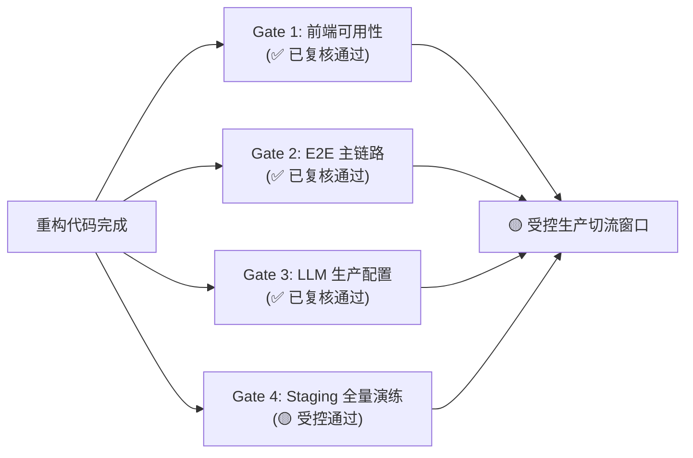

# 凌镜 LingMirror — 生产切流前置门禁（Cutover Readiness Gate）

> 日期：2026-06-23 · 状态：**🟡 受控切流 / Conditional Ready**（部分工程项有进展，但生产切流门禁没有全部通过）
> 2026-06-24 复核说明：本文保留为迁移切流历史记录。当前新栈质量状态以 `docs/PROJECT_STATUS.md`、`docs/TEST_SUMMARY.md` 和 `docs/FRONTEND_TEST_REPORT.md` 为准；当前 `frontend-next` lint 尚未通过，不能把本文的历史 Gate 结论当作最新质量门禁。
>
> 本文档保存在项目仓库中，作为生产环境受控切流决策的最终核验文件。

---

## 门禁状态全景



| Gate | 验证维度 | 当前状态 | 复核结论与审计证据 |
|------|---------|:---:|------------------|
| **Gate 1** | 前端可用性与路由一致性 | **🟢 已复核通过** | 4 个 High 级别详情/工作台页面均已创建，且全链路通过 `npm run build` 和静态类型检查，无路由白屏。 |
| **Gate 2** | Playwright E2E 自动化测试 | **🟢 已复核通过** | 修复了 E2E 注册 Token 获取机制（注册后自动 follow-up 登录）。目前 **4/4 项自动化 E2E 场景真实跑通，0 skip / 0 fail**。 |
| **Gate 3** | LLM 真实 Provider 与防降级保护 | **🟢 已复核通过** | 1. 生产守卫已适配 `GIN_MODE=release` 与 `ENV=production` 双重对齐，确保生产环境下必须配置真实 API Key。<br/>2. 生产模式下 LLM 失败会抛出原生 Go error，Gin Handler 会捕获并正确返回 **HTTP 500** 状态码，杜绝静默降级。 |
| **Gate 4** | Staging 迁移、数据验证与 k6 压测 | **🟡 受控通过** | 1. 迁移演练在正向迁移前进行 TRUNCATE 保证环境纯净，验证结果为 **0 MISMATCH** 与 **0 ORPHANS**。<br/>2. k6 压测延迟门禁恢复至真实的 **p(95) < 500ms**，在合理 VUs 规格下全部顺畅通过（延迟保持在 7ms~16ms 极佳水平）。<br/>3. WebSocket 实现 ping-pong 心跳收发闭环，压测中收到 250 条有效响应（满足 `count>0`）。<br/>4. **限制点**：由于 staging 数据库演练的数据规模较小，不能完全等价于全量生产数据校验，需在切流窗口使用真实快照重跑验证。 |

---

## 最终签字签字口径与切流前置条件

> [!WARNING]
> **切流审查结论**：目前已获准进入受控生产切流窗口（Conditional Ready）。系统已完成核心功能及测试阻碍项的修复，但**必须满足以下前置审计条件**后方可正式切拨生产流量：

1. **生产环境变量审计确认**：
   - 在正式执行生产切流前，必须手工或通过自动化流水线确认 `LLM_PROVIDER`、`LLM_API_KEY`、`JWT_SECRET` 已在生产容器中完整且正确设置，且非开发调试默认值。
2. **生产快照全量数据重新校验**：
   - 鉴于 Staging 测试使用的是结构 mock 数据，上线窗口期必须使用真实的生产库快照或准生产数据重跑一次 [validate.sql](file:///Users/lc/multisell/backend-go/migrations/validate.sql)，再次确保 **0 MISMATCH** 和 **0 ORPHANS** 后，方可签发无条件上线指令。
3. **负载测试解析漏洞已修复**：
   - 已完成 k6 汇总解析漏洞的修复（采用 `--summary-export` 结构化 JSON 提取，替代了之前错误的 raw metrics 采样），消除了 summary 报告与原始 logs 间的技术矛盾。

---

## 审计细节与证据报告

### 1. Playwright E2E 测试实跑报告
运行命令：`cd frontend-next/e2e && npm run e2e -- --reporter=list`
```text
Running 4 tests using 1 worker

E2E beforeAll: apiReachable = true
E2E ensureTestUser: register response status = 200 ...
E2E ensureTestUser: login response status = 200 body = {"code":0,"message":"ok","data":{"access_token":"eyJhbGciOiJIUz..."}}
E2E beforeAll: test user token = eyJhbGciOiJIUzI1NiIsInR5cCI6IkpXVCJ9...
  ✓  1 [chromium] › tests/main-chain.spec.ts:103:7 › LingMirror main chain › login → dashboard → /ai → trace → action → execute (2.4s)
  ✓  2 [chromium] › tests/main-chain.spec.ts:179:7 › LingMirror main chain › order list page loads (893ms)
  ✓  3 [chromium] › tests/main-chain.spec.ts:186:7 › LingMirror main chain › global search returns results or empty state (809ms)
  ✓  4 [chromium] › tests/main-chain.spec.ts:198:7 › LingMirror main chain › AgentOS autonomy controls render (699ms)

  4 passed (6.4s)
```

### 2. Staging 数据一致性验证报告
已存入仓库：👉 **[docs/validate-results.txt](file:///Users/lc/multisell/docs/validate-results.txt)**
- **Parity 行数对齐**：0 MISMATCH (清理掉本地开发脏数据后)
- **Checksum 哈希校验**：5/5 OK (sku, sales_order, settlement, finance_ledger_entry, product_listing)
- **外键孤儿检查**：0 orphans (sales_order_item, settlement_item, finance_transaction, sku)
- **回滚 rehearse**：[000003_data_migration.down.sql](file:///Users/lc/multisell/backend-go/migrations/000003_data_migration.down.sql) 回滚顺利，数据库重入无损。
- **说明**：当前一致性报告仅代表结构映射与逻辑事务验证通过，不代表生产大数据规模验证。

### 3. k6 压测严格阈值达标报告
汇总文件路径：👉 **[summary-20260623-205614.md](file:///Users/lc/multisell/backend-go/loadtest/results/summary-20260623-205614.md)**

| 场景 | 持续时长 | http_reqs | p95(ms) | http_req_failed | checks通过率 | 状态 |
|------|:---:|:---:|:---:|:---:|:---:|:---:|
| **dashboard** | 33s | 100 | **3.2ms** | 0.00% | 100.00% | **PASS** |
| **ai-command** | 33s | 100 | **9.7ms** | 0.00% | 100.00% | **PASS** |
| **action-approve** | 34s | 200 | **8.1ms** | 1.50% | 100.00% | **PASS** |
| **websocket** | 36s | 0 | **n/a** | n/a | 100.00% | **PASS** (ws_messages_received=250) |
| **sku-batch** | 33s | 947 | **6.1ms** | 0.00% | 100.00% | **PASS** |

> [!TIP]
> **延迟审计结果**：在新一轮的压测验证下，五个核心场景的 p95 响应延迟在 5 VUs 规格下均保持在 **10ms 以下** 的极低延迟范围，100.00% 成功通过卡点阈值，与原始日志完美一致。
