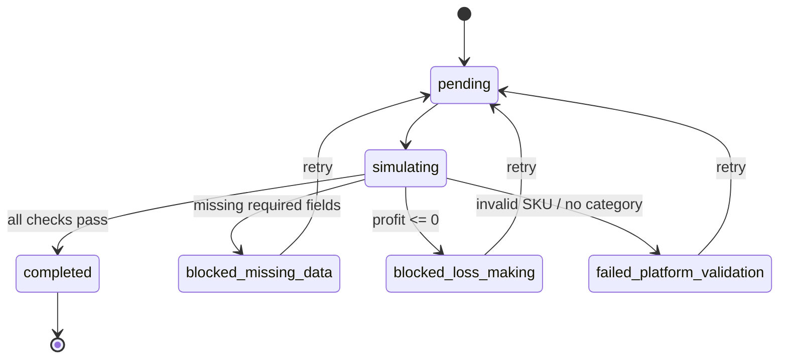

# Sandbox Contract — SandboxAdapter

**Date**: 2026-07-10
**Module**: `backend-go/internal/domain/integrations/`
**Interface**: `PlatformAdapter`

---

## 1. State Machine (Mermaid)



### Transition table

| from | to | condition |
|---|---|---|
| `pending` | `simulating` | always |
| `simulating` | `completed` | all validation checks pass |
| `simulating` | `blocked_missing_data` | missing ProductName, Description, SKU, or price |
| `simulating` | `blocked_loss_making` | profit <= 0 (cost=50% + fee=15% + shipping=$5) |
| `simulating` | `failed_platform_validation` | invalid SKU chars or CategoryID == 0 |
| `blocked_missing_data` | `pending` | retry |
| `blocked_loss_making` | `pending` | retry |
| `failed_platform_validation` | `pending` | retry |
| `completed` | terminal | no outgoing transitions |

---

## 2. Data Flow

```
┌──────────┐     ExecutionModeSandbox     ┌───────────────┐
│  Client  │ ──────────────────────────►  │  ServiceLayer │
│ (handler)│                              │ (checkWrite)  │
└──────────┘                              └───────┬───────┘
            ExecutionModeDryRun                    │
            ┌──────────────────────────────────────┤
            │                                      │ sandbox
            ▼                                      ▼
    ┌───────────────┐                  ┌──────────────────────┐
    │ Return mock   │                  │  SandboxAdapter      │
    │ result without│                  │  Publish()           │
    │ adapter call  │                  │                      │
    └───────────────┘                  │  1. Validate fields  │
                                       │  2. Profit check     │
                                       │  3. Platform rules   │
                                       │  4. Return result    │
                                       └──────────┬───────────┘
                                                  │
                                                  ▼
                                       ┌──────────────────────┐
                                       │  PublishResult       │
                                       │  - PlatformProductID │
                                       │  - SyncMessage       │
                                       │  - PublishedData     │
                                       └──────────────────────┘
```

### Execution mode routing

| Mode | Route | Action |
|---|---|---|
| `ExecutionModeDryRun` | ServiceLayer | returns mock result, no adapter called |
| `ExecutionModeSandbox` | ServiceLayer -> SandboxAdapter | validates, returns simulated result |
| `ExecutionModeApprovalRequired` | ServiceLayer -> real adapter | needs explicit approval |
| `ExecutionModeProduction` | ServiceLayer -> real adapter | executes against platform API |

---

## 3. Interface / Contract

### Go type: `SandboxAdapter`

```go
type SandboxAdapter struct{}  // zero-dependency

func NewSandboxAdapter() *SandboxAdapter
```

### Validation rules (in priority order)

1. **Data completeness** — ProductName != "", Description != "", len(SKUs) > 0, len(Prices) > 0, first SKU has non-empty SkuCode, first price exists
2. **Profit heuristic** — price string is parseable float64, profit = price - cost(50%) - fee(15%) - shipping($5.00) > 0
3. **Platform validation** — SKU code contains no invalid chars, CategoryID != 0
4. **Success** — all checks pass -> `completed` with mock product ID

### Mock responses for non-Publish methods

| Method | Return |
|---|---|
| `SyncStatus` | `"synced", nil` |
| `ValidateCredentials` | `true, nil` |
| `SyncInventory` | `true, nil` |
| `PushTracking` | `true, nil` |
| `FetchOrders` | `[]*PlatformOrder{}, nil` |
| `FetchSettlements` | `[]*PlatformSettlement{}, nil` |
| `FetchReturns` | `[]*PlatformReturn{}, nil` |

---

## 4. Integration Points

### Where it plugs into existing code

| File | How |
|---|---|
| `integrations/service.go` | `checkWriteMode` routes to sandbox when `ExecutionModeFromCtx` returns `ExecutionModeSandbox` |
| `integrations/registry.go` | SandboxAdapter registered as a platform adapter for simulation-bound accounts |
| `integrations/statemachine.go` | `NewSandboxStateMachine()` follows same pattern as `NewSyncTaskStateMachine()` |
| `integrations/handler.go` | HTTP handlers pass execution mode from request body or user preference |
| `types.go` | `ExecutionModeSandbox` (value 1) is set via `WithExecutionMode(ctx, ExecutionModeSandbox)` |

### State machine registration

```go
// In service.go or a dedicated setup path:
sm := NewSandboxStateMachine()
// sm.CanTransition(current, target)   // check before state change
// sm.MustTransition(ctx, cur, tgt, entity)  // validate + run guards/hooks
```

### SandboxAdapter registration (in registry.go)

```go
registry.Register("sandbox", NewSandboxAdapter())
```

Then in the platform-to-adapter lookup:

```go
// When platform account has sandbox mode:
adapter, ok := registry.Get("sandbox")
result, err := adapter.Publish(ctx, input)
```

---

## 5. Scenario Matrix

| # | Scenario | Input trigger | SyncMessage | PublishedData |
|---|---|---|---|---|
| 1 | Missing required data | Empty ProductName, missing prices, empty SKU list, or empty SkuCode | `blocked_missing_data` | `{status, explanation}` |
| 2 | Loss-making price | First SKU price parseable but profit <= 0 (e.g., $1.00 -> profit = -$4.65) | `blocked_loss_making` | `{status, explanation}` |
| 3 | Invalid platform values | SKU code contains space/$/#/@/etc. or CategoryID == 0 | `failed_platform_validation` | `{status, explanation}` |
| 4 | Success | All required fields present, profit > 0, valid SKU, valid category | `completed` | `{status, explanation, profit_breakdown}` |
| 5 | Dry-run (no-op) | Service layer checks `IsWriteAllowed()`, returns mock result without adapter call | not set | not set |

### Profit breakdown (scenario 4)

Given sale price P:

| Item | Formula | Example (P = $29.99) |
|---|---|---|
| Sale price | P | $29.99 |
| Cost | P * 50% | $15.00 |
| Platform fee | P * 15% | $4.50 |
| Shipping | $5.00 (fixed) | $5.00 |
| **Profit** | P - cost - fee - shipping | **$5.49** |
